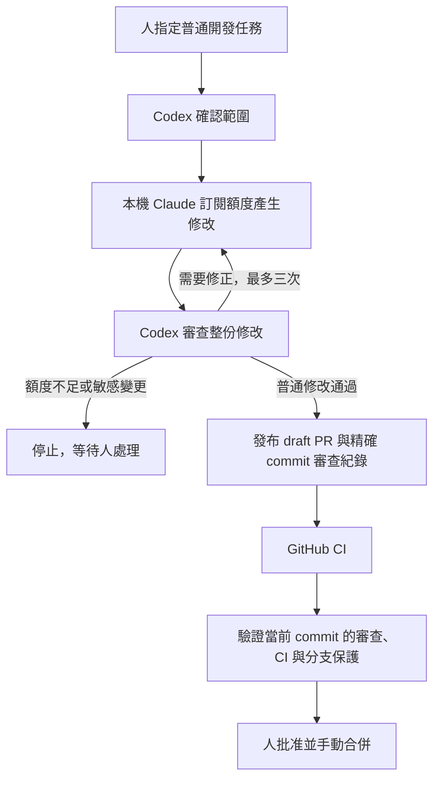

# AI Development Loop：使用既有訂閱，不增加模型 API 費用

這個版本使用本機 Claude Code 的 **Claude Pro/Max 訂閱登入**來實作，由本次 Codex
對話獨立審查與回饋。GitHub Actions 只執行 CI、驗證審查紀錄及維持人工合併關卡。
不呼叫 Anthropic/OpenAI 模型 API，也不把訂閱登入憑證放到 GitHub。
既有訂閱本身仍有費用與額度限制；此處的「免費」指不另外購買 API 或超額用量。

## 實際流程



協作需要電腦開機、本機登入有效，以及正在執行的 Codex 工作。它不是全天候 GitHub
雲端實作服務。你只需在 Codex 指定任務；Codex 可自行呼叫本機 Claude、讀取修改並回饋，
不需要你往返複製提示詞。額度耗盡會停止，不自動購買、儲值或切換付費 API。

## 本機使用

1. 安裝官方 Claude Code、Python 3.12+、Git；在 Claude Code 登入既有 Claude 訂閱。
   Codex 使用既有 ChatGPT 訂閱登入。本流程不需要新增 API key。
2. 在 Claude Settings → Usage 確認 **Extra usage 關閉**、**Auto reload 關閉**。
   每次使用前確認；`--extra-usage-off-confirmed` 是操作人確認，並非程式查詢帳務。
3. 建立乾淨的 `claude/*` 任務分支，更新 `origin/main`，把任務與驗收條件寫成 checkout
   以外的文字檔。敏感範圍必須先停止，另交人工核准與監督。
4. 由 Codex 在本機執行：

```bash
python .github/ai-loop/local_claude.py --repo /path/to/checkout --session /path/outside/checkout/task-session --task /path/to/task.md --extra-usage-off-confirmed
# Codex 如發現問題，以同一任務、同一來源 commit、同一 session 傳回回饋：
python .github/ai-loop/local_claude.py --repo /path/to/checkout --session /path/outside/checkout/task-session --task /path/to/task.md --feedback /path/to/feedback.md --extra-usage-off-confirmed
```

Windows 可使用對應的完整 Windows 路徑。每個任務的 session 保留原始 commit、任務 hash、
檔案 manifest 與嘗試數，最多三次、每次 12 turns／10 分鐘；失敗也計次。
不要刪除或重建同一任務的 ledger 來繞過限制。用完後由人決定是否另立新範圍。

工具只複製 Git 中的正常追蹤檔案到普通目錄；不複製 `.git`、未追蹤 `.env`、依賴、
MCP 或 agent 設定。指引與 Architecture 取自可信的 `origin/main`。子行程移除 API/provider
與 GitHub 環境憑證，停用 hooks、MCP、Chrome、slash commands、快速模式與自動重試。
只接受 first-party `claude.ai` 的 Pro/Max/Team/Enterprise 登入；其他認證停止。
**不用 `--bare`**，因為該模式不讀取 OAuth 訂閱登入。

Claude 只有 Read/Edit/Write/Glob/Grep，沒有 shell、GitHub 或 migration 工具。
這個普通目錄與 CLI 權限不是作業系統沙箱；不能宣稱能抵抗所有提示注入。
不得給任務真實客戶／財務資料或秘密，Codex 必須檢查整份 export，必要時使用更強的隔離。
`changes.json` 只是提案，不會自動套用、commit 或 push。保護檔案、symlink、二進位、
空修改、80 檔／160 KB 以上、疑似金鑰等輸出會整份拒絕。

## 獨立 Codex 審查與 GitHub gate

Codex 檢查完整修改、Architecture 一致性、敏感語意與實際 CI，確認後才發布普通修改。
把真正的 Codex 審查結果透過維護者身分發布成 PR comment（不是 GitHub APPROVE review）：

```text
<!-- local-ai-review -->
{"head_sha":"<當前完整40字元SHA>","engine":"codex","decision":"approve","summary":"實際審查範圍與結果","findings":[]}
```

`decision` 可為 `approve`、`changes_requested`、`human_required`；每個 finding 必須包含
`path`、`severity`（`blocking` 或 `advisory`）、`description`。
只接受真人且具 write/maintain/admin 權限的維護者紀錄，忽略 bot 與無權使用者。
這是維護者對本機 AI 審查的背書，不能當作模型執行的密碼學證明；不要填寫未執行的審查。
最新授權紀錄若格式錯誤或 SHA 過期，整個 gate 停止，不能回退到舊的有利紀錄。

Actions 在新 PR commit、標記審查 comment 與 CI 完成時重新檢查。只 checkout `main`
可信腳本，經 API 讀取 PR 資料，絕不在有寫入權限的 gate 執行 PR code。
CI 使用 read-only token，沒有 AI secret；原有 format/lint/typecheck/test/build/Docker 檢查保留。
Bot comment 不會觸發修正，沒有定時重試、模型呼叫或自動修正 workflow，避免循環。
事件密集時 GitHub 的單一 pending concurrency run 可能取代另一個；可手動重跑 gate。

普通修改要同一 SHA 的完整 CI 與 Codex 審查通過才有 `ai/review-gate` success。
敏感路徑或語意必須有人工監督實作、真正的獨立真人對當前 SHA 的 APPROVED review 與 CI。
作者、bot、過期審查均不能替代真人批准；AI 有 blocking findings 時，人工批准也不能使 gate 通過。

```bash
gh workflow run ci.yml --ref main -f pr_number=123 -f target_sha=<current-head-sha>
gh workflow run ai-development-loop.yml --ref main -f pr_number=123
```

`GITHUB_TOKEN` push 不會自動觸發 CI，bot 發布須明確 dispatch CI。
人批准後可由人或本次 Codex 工作重跑 gate；不監聽 `pull_request_review` 執行 PR 工作流。
分支更新後，舊審查失效；發布前與寫入 gate 前再次核對 head，並以非 force 更新任務分支。

## 保留的人工與敏感範圍關卡

- Architecture Approved v0.3、ADR、核心設計保持不變。
- DB schema/migration、DROP/TRUNCATE/reset、資安、權限、tenant/project isolation、
  金額計算／財務狀態／指標與 production 部署，全部先停止等人核准；不得由 Claude 自行實作。
- Phase 2 仍須先有人接受 ADR-34 / §11.2 的 disposable DB PoC；不得直接產生全套 schema。
- `main` 要求至少一次獨立真人及 CODEOWNER review、撤銷過期批准、最後 push 的獨立批准、
  對話解決、分支同步，以及 `verify`、`docker`、`ai-loop-tests`、`ai/review-gate`。
- 保護套用管理員；沒有 AI bypass；禁止 force push、刪除主分支與 auto-merge。
- draft PR 最後由人標記 ready、批准與手動 merge；AI 不提交 APPROVE、呼叫 merge 或部署。

| Label                  | 含義                                       |
| ---------------------- | ------------------------------------------ |
| `ai:enabled`           | 普通任務同意進入本機協作，不能批准敏感範圍 |
| `ai:changes-requested` | Codex 或 CI 需要修正                       |
| `ai:human-required`    | 範圍、證據、失敗或額度需要人處理           |
| `ai:ready-to-merge`    | 當前審查及 CI 通過；仍由人批准與合併       |

## 此版本啟用與費用

舊的 API workflow 已停用，`AI_LOOP_ENABLED=false`。不要重新啟用舊版本。
人先批准及手動合併此替換版本，再從 Actions 啟用 **AI Development Loop** 的本機審查 gate。
bootstrap PR 的 gate 由限於精確 commit、無模型 API 的一次性輔助程序，在獨立真人批准與 CI
通過後檢查；不得移除必需 status 或使用行政 bypass。

唯一仍需的 secret 是 `AI_PROTECTION_READ_TOKEN`：僅 CEproject Administration read、Metadata read，
用來讀取分支保護。它不是 AI API key，沒有寫入權限。現有 token 到期日 2026-11-06，
到期前以同等最小權限更新；到期後 gate 停止。既有 `ANTHROPIC_API_KEY`、`OPENAI_API_KEY`
與 `OPENAI_REVIEW_MODEL` 不被新 workflow 使用。不要把 Claude/Codex OAuth token 放到 GitHub。
歷史 API 實作檔只供舊版本參考，新 workflow 不執行 `controller.plan/publish/review` 或 `agent.py`。

公開 repository 的標準 GitHub-hosted runner 使用 GitHub 的免費規則；不要改用付費 larger
runner。私人 repo、額外儲存或其他產品有不同計費條件。本流程不新增付費產品。
訂閱配額與供應商政策會變；使用量不足停下來，等重置或人工處理。

## 驗證與官方依據

`ai-loop-tests` 執行本機協作及既有 guardrail tests、checksum-verified actionlint。
安全測試包括 API 環境清除、受保護修改拒絕、bot／無權／舊 commit 的審查拒絕、CI
缺失、敏感語意的人工 gate、blocking finding 不可被人工批准覆蓋。
不在 CI 執行真實模型呼叫。本機小型文件任務用於確認訂閱登入與 Claude → Codex 回饋。

- [Codex subscription authentication](https://learn.chatgpt.com/docs/auth)
- [Claude Code authentication](https://code.claude.com/docs/en/authentication)
- [Claude Code headless usage and bare mode](https://code.claude.com/docs/en/headless)
- [GitHub Actions billing](https://docs.github.com/en/billing/concepts/product-billing/github-actions)
