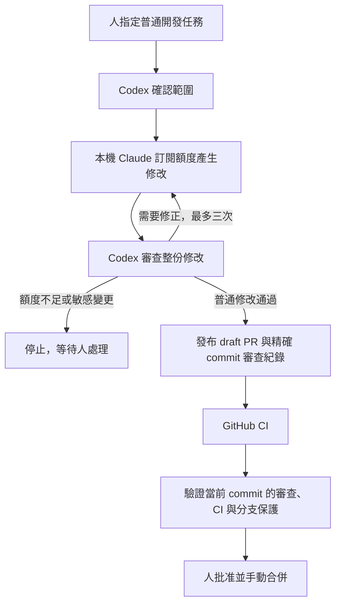

# AI Development Loop：使用既有訂閱，不增加模型 API 費用

這個版本使用本機 Claude Code 的 **Claude Pro/Max 訂閱登入**來實作，由本次 Codex
對話獨立審查與回饋。GitHub Actions 只執行 CI、驗證審查紀錄及維持人工合併關卡。
不呼叫 Anthropic/OpenAI 模型 API，也不把訂閱登入憑證放到 GitHub。
既有訂閱本身仍有費用與額度限制；此處的「免費」指不另外購買 API 或超額用量。

CEproject 採用單人維護模式：一般修改由 Codex 與 CI 驗收，最後由維護者在 GitHub
手動合併；不要求 PR 作者批准自己的 GitHub PR。這不是自動合併授權。

## 實際流程



協作需要電腦開機、本機登入有效，以及正在執行的 Codex 工作。它不是全天候 GitHub
雲端實作服務。你只需在 Codex 指定任務；Codex 可自行呼叫本機 Claude、讀取修改並回饋，
不需要你往返複製提示詞。額度耗盡會停止，不自動購買、儲值或切換付費 API。

## 本機使用

1. 安裝官方 Claude Code、Python 3.12+、Git；在 Claude Code 登入既有 Claude 訂閱。
   Codex 使用既有 ChatGPT 訂閱登入。本流程不需要新增 API key。
2. 在 Claude Settings → Usage 確認 **Extra usage 關閉**、**Auto reload 關閉**。
   每次使用前確認；`--extra-usage-off-confirmed` 是操作人確認，並非程式查詢帳務。
3. 建立乾淨的 `claude/*` 任務分支，更新 `origin/main`，把任務與驗收條件寫成 checkout
   以外的文字檔。敏感範圍必須先停止，另交人工核准與監督。
4. 由 Codex 在本機執行：

```bash
python .github/ai-loop/local_claude.py --repo /path/to/checkout --session /path/outside/checkout/task-session --task /path/to/task.md --extra-usage-off-confirmed
# Codex 如發現問題，以同一任務、同一來源 commit、同一 session 傳回回饋：
python .github/ai-loop/local_claude.py --repo /path/to/checkout --session /path/outside/checkout/task-session --task /path/to/task.md --feedback /path/to/feedback.md --extra-usage-off-confirmed
```

Windows 可使用對應的完整 Windows 路徑。每個任務的 session 保留原始 commit、任務 hash、
檔案 manifest 與嘗試數，最多三次、每次 12 turns／10 分鐘；失敗也計次。
不要刪除或重建同一任務的 ledger 來繞過限制。用完後由人決定是否另立新範圍。

工具只複製 Git 中的正常追蹤檔案到普通目錄；不複製 `.git`、未追蹤 `.env`、依賴、
MCP 或 agent 設定。指引與 Architecture 取自可信的 `origin/main`。子行程移除 API/provider
與 GitHub 環境憑證，停用 hooks、MCP、Chrome、slash commands、快速模式與自動重試。
只接受 first-party `claude.ai` 的 Pro/Max/Team/Enterprise 登入；其他認證停止。
**不用 `--bare`**，因為該模式不讀取 OAuth 訂閱登入。

Claude 只有 Read/Edit/Write/Glob/Grep，沒有 shell、GitHub 或 migration 工具。
這個普通目錄與 CLI 權限不是作業系統沙箱；不能宣稱能抵抗所有提示注入。
不得給任務真實客戶／財務資料或秘密，Codex 必須檢查整份 export，必要時使用更強的隔離。
`changes.json` 只是提案，不會自動套用、commit 或 push。保護檔案、symlink、二進位、
空修改、80 檔／160 KB 以上、疑似金鑰等輸出會整份拒絕。

## 獨立 Codex 審查與 GitHub gate

Codex 檢查完整修改、Architecture 一致性、敏感語意與實際 CI，確認後才發布普通修改。
把真正的 Codex 審查結果透過維護者身分發布成 PR comment（不是 GitHub APPROVE review）：

```text
<!-- local-ai-review -->
{"head_sha":"<當前完整40字元SHA>","engine":"codex","decision":"approve","summary":"實際審查範圍與結果","findings":[]}
```

`decision` 可為 `approve`、`changes_requested`、`human_required`；每個 finding 必須包含
`path`、`severity`（`blocking` 或 `advisory`）、`description`。
只接受真人且具 write/maintain/admin 權限的維護者紀錄，忽略 bot 與無權使用者。
這是維護者對本機 AI 審查的背書，不能當作模型執行的密碼學證明；不要填寫未執行的審查。
最新授權紀錄若格式錯誤或 SHA 過期，整個 gate 停止，不能回退到舊的有利紀錄。

Actions 在新 PR commit、標記審查 comment 與 CI 完成時重新檢查。只 checkout `main`
可信腳本，經 API 讀取 PR 資料，絕不在有寫入權限的 gate 執行 PR code。
CI 使用 read-only token，沒有 AI secret；原有 format/lint/typecheck/test/build/Docker 檢查保留。
Bot comment 不會觸發修正，沒有定時重試、模型呼叫或自動修正 workflow，避免循環。
事件密集時 GitHub 的單一 pending concurrency run 可能取代另一個；可手動重跑 gate。

普通修改要同一 SHA 的完整 CI 與 Codex 審查通過才有 `ai/review-gate` success。
敏感路徑或語意仍須先有具體人工計畫核准與監督實作，再由 repository owner 審閱完成的
當前 SHA，親自留下明確範圍批准紀錄及通過 CI。單人維護者可以是 PR 作者；不使用 GitHub
禁止作者自批的 APPROVED review 當作此證據。Bot、其他帳號、過期紀錄、一般 AI 審查或
label 均不能替代 owner 的明確批准；AI 有 blocking findings 時，人工批准也不能使 gate 通過。

### 敏感範圍的人工批准

僅適用於個人 repository 的 owner（此 repo 為 `zrco001`），且帳號必須具有 admin 權限。
維護者確認已核准計畫、監督實作並審閱完成的 patch 後，在該 PR 親自貼上：

```text
<!-- human-scope-approval -->
{"head_sha":"<當前完整40字元SHA>","decision":"approve","scope":"具體核准範圍及計畫連結"}
```

這是人對已審閱 patch 的紀錄，不得由 AI 擅自生成，也不授權 Claude 自動修改保護檔案。
最近的 owner 紀錄為準；`decision` 改成 `reject` 即撤銷。錯誤、過期或空白範圍紀錄也會
阻擋，不能回退到先前有利批准。更新 commit 後必須重新審閱及記錄完整新 SHA。
與本機 Codex attestation 一樣，GitHub 帳號身分不能以密碼學證明鍵盤前是人或 AI。
請勿把可寫入的維護者 token 給自動 Claude runner；Actions 的 token 沒有 contents:write。

```bash
gh workflow run ci.yml --ref main -f pr_number=123 -f target_sha=<current-head-sha>
gh workflow run ai-development-loop.yml --ref main -f pr_number=123
```

`GITHUB_TOKEN` push 不會自動觸發 CI，bot 發布須明確 dispatch CI。
人批准後可由人或本次 Codex 工作重跑 gate；不監聽 `pull_request_review` 執行 PR 工作流。
分支更新後，舊審查失效；發布前與寫入 gate 前再次核對 head，並以非 force 更新任務分支。

## 保留的人工與敏感範圍關卡

- Architecture Approved v0.3、ADR、核心設計保持不變。
- DB schema/migration、DROP/TRUNCATE/reset、資安、權限、tenant/project isolation、
  金額計算／財務狀態／指標與 production 部署，全部先停止等人核准；不得由 Claude 自行實作。
- Phase 2 仍須先有人接受 ADR-34 / §11.2 的 disposable DB PoC；不得直接產生全套 schema。
- `main` 仍要求 PR；GitHub 必需 approving review 數為 0，CODEOWNER 必批與最後 push 必批
  關閉，避免單人維護者無法自批的死結。CODEOWNERS 保留為責任歸屬紀錄。
- 保留 stale approval 撤銷、對話解決與 strict 分支同步；`verify`、`docker`、`ai-loop-tests`、
  `ai/review-gate` 皆為必需，且綁定 GitHub Actions app 15368。
- 保護套用管理員；禁止 force push、刪除主分支與 auto-merge。可信 main gate 核對上述
  單人設定，不允許 PR 內容、label 或變數切換審查模式。歷史 API runner 保留原獨立審查模式且停用。
- 最後由人標記 ready、審閱及手動 merge；Claude、Codex 與 Actions 不提交 APPROVE、呼叫 merge 或部署。

### 大型敏感 PR 的監督審查路徑

普通審查與自動修改的 160,000 bytes／80 檔上限不變。超過文字預算的 PR 不會因 label、
檔案數或一句「審查通過」解鎖。Codex 必須取得固定 commit 的完整檔案，逐檔審查及驗證；
GitHub 截斷的 patch 不能作為全部已審查的證據。這条路徑只接受 `human_required` 決定、
另外的 owner 當前 SHA 範圍批准及完整 CI；blocking findings 一律阻擋。

使用 `python .github/ai-loop/review_manifest.py <PR號碼>`（需已登入 gh）取得 `review_manifest`，
將此物件加到真正的 `local-ai-review` attestation。這是唯讀操作，不讀 Secret、不執行 PR 程式。
Receipt 綁定 base/head SHA、完整檔案數、增刪行數及排序後清單的 SHA-256；清單包含每個
檔案的路徑、舊名稱、Git blob SHA、變更種類與增刪行數。仍限制 80 檔，且所有頁面／總數
必須一致。可信 main gate 重新取得清單並核對，不信任 PR 提供的成功結果。

人批准和 AI attestation 是兩種獨立紀錄。修改、刪除批准紀錄或更新 head 後會重新檢查；
base 改變也會使 receipt 失效，須重新核對差異及產生審查紀錄。此路徑不執行 DB PoC、
不代表 ADR 已接受，也不授權自動修改 protected paths 或合併。

### 從原有雙人規則過渡

原 main 的可信 gate 不認識單人規則。一次性過渡使用只含流程設定的 PR，不包含其他 PR 的 UI。
先完成 Codex 審查、CI 及固定 head 的 owner 範圍批准，最後仍由維護者手動合併。

過渡期間保留四個必要檢查，另加 `ai/single-maintainer-bootstrap`（也綁 GitHub Actions app
15368）。單人 reviewer 數改為 0、CODEOWNER 必批及 last-push 必批關閉；strict、管理員
保護、对話解決、禁止 force push/delete、auto-merge 關閉全部保留。額外 bootstrap 檢查
只接受固定設定 PR 的完整 CI、真實 Codex 審查及 owner exact-head 批准；其他 PR 無法
取得它的 success，因此不能在設定過渡期間先合併。

已審查的一次性 manual-only bootstrap workflow 在暫存分支執行；它只讀取固定已審查 SHA
的 gate 程式，不安裝套件、不執行其他 PR 程式、不修改保護、不提交 APPROVE 或 merge。
在使用者先標記 ready 並留下當前 SHA 範圍批准後才執行，產生兩項真實審查狀態。
既有 main 的舊 gate 仍可能回報單人設定不相容；不得刪除或偽造結果。

設定 PR 由人合併後，Codex 核對 main 所有設定檔與已審查 blob 一致，才移除額外 bootstrap
context；四項必要檢查及 app 綁定持續保留。再從可信 main 檢查 PR #10。strict 要求 PR #10
同步新的 main；新 head 需要 CI、Codex 審查及新的 owner 範圍批准。不得沿用舊 head 的批准。

| Label                  | 含義                                       |
| ---------------------- | ------------------------------------------ |
| `ai:enabled`           | 普通任務同意進入本機協作，不能批准敏感範圍 |
| `ai:changes-requested` | Codex 或 CI 需要修正                       |
| `ai:human-required`    | 範圍、證據、失敗或額度需要人處理           |
| `ai:ready-to-merge`    | 當前審查及 CI 通過；仍由人批准與合併       |

## 此版本啟用與費用

舊的 API workflow 已停用，`AI_LOOP_ENABLED=false`。不要重新啟用舊版本。
人先批准及手動合併此替換版本，再從 Actions 啟用 **AI Development Loop** 的本機審查 gate。
bootstrap PR 的 gate 由限於精確 commit、無模型 API 的一次性輔助程序，在獨立真人批准與 CI
通過後檢查；不得移除必需 status 或使用行政 bypass。

唯一仍需的 secret 是 `AI_PROTECTION_READ_TOKEN`：僅 CEproject Administration read、Metadata read，
用來讀取分支保護。它不是 AI API key，沒有寫入權限。現有 token 到期日 2026-11-06，
到期前以同等最小權限更新；到期後 gate 停止。既有 `ANTHROPIC_API_KEY`、`OPENAI_API_KEY`
與 `OPENAI_REVIEW_MODEL` 不被新 workflow 使用。不要把 Claude/Codex OAuth token 放到 GitHub。
歷史 API 實作檔只供舊版本參考，新 workflow 不執行 `controller.plan/publish/review` 或 `agent.py`。

公開 repository 的標準 GitHub-hosted runner 使用 GitHub 的免費規則；不要改用付費 larger
runner。私人 repo、額外儲存或其他產品有不同計費條件。本流程不新增付費產品。
訂閱配額與供應商政策會變；使用量不足停下來，等重置或人工處理。

## 驗證與官方依據

`ai-loop-tests` 執行本機協作及既有 guardrail tests、checksum-verified actionlint。
安全測試包括 API 環境清除、受保護修改拒絕、bot／無權／舊 commit 的審查拒絕、CI
缺失、敏感語意的人工 gate、blocking finding 不可被人工批准覆蓋。
不在 CI 執行真實模型呼叫。本機小型文件任務用於確認訂閱登入與 Claude → Codex 回饋。

- [Codex subscription authentication](https://learn.chatgpt.com/docs/auth)
- [Claude Code authentication](https://code.claude.com/docs/en/authentication)
- [Claude Code headless usage and bare mode](https://code.claude.com/docs/en/headless)
- [GitHub Actions billing](https://docs.github.com/en/billing/concepts/product-billing/github-actions)
