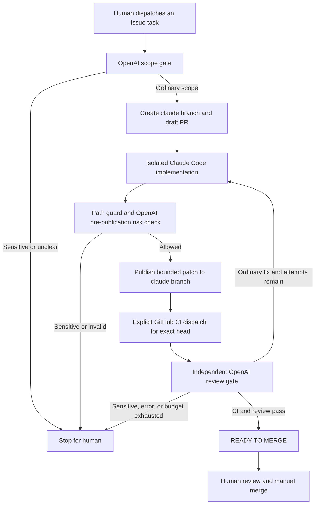

# AI Development Loop

## Repository baseline (2026-10-07)

- Default branch: `main`, commit `fb07031f70f5788d9f6a171aa97553336522fe32`.
- Existing implementation branch: `claude/phase-1-review-fixes`, commit
  `40e73be9b4a8535476bb816af2eec8c58793454d`. Its latest CI passed; it has no open PR.
- `main` latest CI also passed. No open PRs, branch protection, or repository rulesets were present.
- `docs/ARCHITECTURE.md` is **Architecture Approved v0.3**. This change preserves it byte-for-byte.
- Existing CI performs format, lint, typecheck, tests, build, Docker image builds and compose validation.
- The existing Claude branch's money/Docker changes are not included in this infrastructure PR.
  Review and integrate that branch separately; preserve the new workflow dispatch and loop checks.

## Roles and execution



`AI Development Loop` is event-driven by the **completed CI workflow**. It runs trusted scripts
from `main`, reads PR diffs through GitHub APIs, and never executes PR code in privileged review
or publication jobs. Claude Code runs in a disposable Docker container without GitHub tokens,
shell tools, MCP, hooks, plugins, or automatically loaded PR instructions. The default-branch
instructions are copied into its plain source snapshot. Application dependencies are not installed
in that container. CI runs application code separately with a read-only token and no AI secrets.

OpenAI uses the Responses API with strict structured JSON output and `store: false`. It has no
tools. The model is selected explicitly by the administrator using `OPENAI_REVIEW_MODEL`.
GitHub comments and the `ai/review-gate` commit status record the review. AI never submits an
APPROVE review, changes protected-branch settings, runs migrations, deploys, or calls a merge API.

## Guardrails

- The loop is **off unless `AI_LOOP_ENABLED=true`**. Review and publication fail closed when
  keys, model selection, protection, CI evidence, or reviewer output are unavailable.
- Before any automatic work, it verifies enforced `main` branch protection, human/code-owner
  review, dismissal of stale approvals, and all required checks. Repository auto-merge must be off.
- Maximum **three Claude attempts for the entire PR**, including initial implementation.
  Maximum 20 Claude turns, USD 5 per attempt, 20-minute implementation job. OpenAI calls have
  90-second HTTP timeouts and an 8,000 output-token cap. There is no unbounded retry loop.
- Bot-authored attempt comments bind reservations to a PR and SHA. The same SHA cannot be
  implemented again. All runs serialize through one repository concurrency group.
- GitHub retains only one pending concurrency run. Event bursts may supersede pending reviews;
  a PR left pending is safe to review manually through workflow dispatch. No scheduled sweeper
  is enabled. Do not delete bot attempt comments to reset the budget.
- Closed PRs, foreign/fork PRs, wrong base branches, stale heads, non-`claude/*` edits, and
  PRs without explicit `ai:enabled` opt-in cannot receive automatic fixes.
- Up to 80 changed files / 160 KB of diff or generated text. Missing, binary, truncated, malformed,
  oversized, symlink, or special-file content stops the loop. No partial diff can pass silently.
- Sensitive scope always stops automatic implementation: architecture, DB schema/migrations,
  destructive operations, security, authentication, authorization, tenant/project isolation,
  financial rules/calculations/state transitions/metrics, and deployment.
- Conservative protected paths include `packages/shared/**`, `packages/db/**`, contracts/config,
  sensitive API/web modules, SQL/Prisma, dependency files, scripts, workflows, agent configuration,
  ADRs and the architecture document. Both old and new rename paths are checked.
- Even ordinary paths receive a semantic OpenAI risk review before publication. This is an
  additional heuristic; sensitive code must still be reviewed by humans and enforced CODEOWNERS.
- Publishing uses GitHub blobs/trees/commits and a non-force, fast-forward ref update from the
  exact reviewed head. A concurrent update discards the patch. There is no direct push to `main`.
- `GITHUB_TOKEN` writes normally do not trigger push/PR workflows. The publisher explicitly
  dispatches `CI` from `main` with the PR number and exact SHA. CI validates those inputs and checks
  out that SHA; the subsequent completion triggers independent review. No PAT is used to trigger
  bot comments, no `@claude` comment cycle is installed, and no workflow listens to label changes.
- New commits reset the status to pending and need fresh CI/review. Status checks enforce the
  current head; labels and template checkboxes are informational, never approval authority.

## Required one-time GitHub configuration

This PR is a bootstrap change. The reviewer workflow exists only after a human merges it into
`main`. Do **not** require its unavailable status before that bootstrap merge.

1. Review this PR and its CI manually, then manually merge. Leave the AI loop disabled.
2. Add a second trusted human collaborator with write access and update `.github/CODEOWNERS`
   when owner-authored PRs must be reviewed. A PR author cannot approve their own PR; the present
   owner is `@zrco001`. Do not use a bot or administrative bypass to satisfy this review.
3. In repository Settings → General, disable **Allow auto-merge**. In Settings → Actions,
   keep default token permissions read-only. Allow workflows to create pull requests. GitHub may
   present this as the combined **Allow GitHub Actions to create and approve pull requests**
   setting; enable it for task PR creation. This loop never submits APPROVE reviews, and bot
   reviews cannot satisfy its human gate.
4. In Settings → Branches, protect `main` with:
   - Require pull requests, at least one human approval and code-owner review.
   - Dismiss stale approvals after new commits; require conversation resolution.
   - Required status checks: `verify`, `docker`, `ai-loop-tests`, `ai/review-gate`.
   - Require branches up to date before merge; do not allow force pushes or branch deletion.
   - Enforce the rule for administrators; no bypass actor for the AI or GitHub Actions app.
5. In Settings → Secrets and variables → Actions, set:

| Kind     | Name                       | Purpose                                                                                    |
| -------- | -------------------------- | ------------------------------------------------------------------------------------------ |
| Secret   | `ANTHROPIC_API_KEY`        | Anthropic API key for the isolated Claude CLI; configure a provider-side spending limit.   |
| Secret   | `OPENAI_API_KEY`           | OpenAI API project key for scope, risk, and review calls; configure a project spend limit. |
| Secret   | `AI_PROTECTION_READ_TOKEN` | Fine-grained token for only CEproject: Administration **read**, Metadata read; no writes.  |
| Variable | `OPENAI_REVIEW_MODEL`      | An available Responses model supporting strict JSON Schema; choose explicitly.             |
| Variable | `AI_LOOP_ENABLED`          | Keep `false` until the steps above are complete; set `true` to enable.                     |

The separate read-only protection token is needed because `GITHUB_TOKEN` does not expose
`administration: read` in workflow permissions. It is used only to verify settings and is never
passed to Claude or OpenAI. Give it a short expiry and rotate it; expiration stops automation.
No `GH_PAT`, broad write token, production credentials, or database URL is required.
The Claude CLI version is pinned in the Dockerfile; update it only in a human-reviewed PR.

6. Select an ordinary documentation/UI smoke task. For a new task, create a clear GitHub issue
   with acceptance criteria; run **AI Development Loop → Run workflow → mode=start → issue_number**.
   Only a human maintainer may dispatch. It creates a draft `claude/ai-issue-N` branch/PR, checks
   task scope, then implements. Existing task branches are not overwritten.
7. For an existing same-repo PR, a maintainer may add `ai:enabled`, then dispatch CI or run
   **mode=review → pr_number** after CI completes. Only `claude/*` branches are auto-edited.
8. For the first gate status (including this bootstrap PR if tested before merge), select the
   status context manually by name if GitHub's check picker has not seen it yet. Verify all four
   required statuses and a human approval on a later PR before relying on the gate.

Example commands after activation (human-maintainer credentials only):

```bash
gh workflow run ai-development-loop.yml --ref main -f mode=start -f issue_number=123
gh workflow run ai-development-loop.yml --ref main -f mode=review -f pr_number=456
gh workflow run ci.yml --ref main -f pr_number=456 -f target_sha=<exact-current-40-character-sha>
```

## Status and intervention

| Label                  | Meaning and next action                                                   |
| ---------------------- | ------------------------------------------------------------------------- |
| `ai:enabled`           | Maintainer opted this PR into implementation; it does not approve scope.  |
| `ai:changes-requested` | CI/reviewer findings need fixes; bounded attempts may continue.           |
| `ai:human-required`    | Automation paused; investigate scope, error, or exhausted attempts.       |
| `ai:ready-to-merge`    | Current CI and review passed; human approval/manual merge still required. |

For sensitive changes, a human must first approve the design/impact, supervise implementation
outside this automatic loop, and review the exact final commit. A current-head APPROVED review
from a different human collaborator with write/maintain/admin permission, plus successful CI,
allows the gate to pass for that final commit. Bot approvals and stale approvals are ignored.
No human approval enables automatic edits to a protected path. Phase 2 needs its PoC report
and acceptance before full-schema work; destructive migrations also need rollback/backup plans.

For an ordinary recoverable error, investigate before removing `ai:human-required`, then run
`mode=review` manually. This never resets the three-attempt limit or allows retrying the same
reserved SHA. Make a human correction/new commit or create a separately scoped task when the
budget is exhausted. For missing/stale CI, explicitly dispatch CI for the current head first.
If dispatch fails after a patch is published, its gate remains pending and cannot merge.

Set `AI_LOOP_ENABLED=false` and remove `ai:enabled` to stop future automatic work. Publication
rechecks both immediately before publishing; cancel an in-progress run when immediate shutdown
is required. Keep required branch checks enabled while investigating.

Draft PRs stay draft; a human marks them ready for review and merges manually after approval.
Normal non-AI PRs still receive the review gate after CI. The loop does not deploy anything.

## Validation and sources

CI adds `ai-loop-tests` (Python standard-library regression tests and checksum-verified actionlint).
Existing application and Docker checks remain. Tests cover protected paths/renames, stale heads,
attempt budgets, missing/skipped CI, malformed/refused API output, current human approvals,
forks, truncation, and protection configuration. No live model test runs without user-set keys.

- [OpenAI structured output](https://developers.openai.com/api/docs/guides/structured-outputs?api-mode=responses)
- [Claude Code programmatic usage](https://code.claude.com/docs/en/headless)
- [Claude CLI options](https://code.claude.com/docs/en/cli-reference)
- [GitHub workflow trigger behavior](https://docs.github.com/en/actions/how-tos/write-workflows/choose-when-workflows-run/trigger-a-workflow)
- [Protected branches](https://docs.github.com/en/rest/branches/branch-protection)
