# 建築工程記帳與專案成本管理系統 — Architecture Proposal

> 狀態：**Architecture Approved v0.3**
> 日期：2026-10-07
> 範圍：Phase 0（架構設計）完成。可開始 Phase 1；正式 Prisma Schema 須待 Phase 1 完成並通過 Phase 2 Gate 0（Manual Constraint PoC）後建立。
> 變更摘要見 [§13 Change Log](#13-change-log)。

---

## 目錄

0. [摘要與關鍵決策（ADR）](#0-摘要與關鍵決策adr)
1. [需求分析](#1-需求分析)
2. [系統架構 Proposal](#2-系統架構-proposal)
3. [Domain Modules 與財務計算定義](#3-domain-modules-與財務計算定義)
4. [Directory Structure](#4-directory-structure)
5. [Initial Database ERD](#5-initial-database-erd)
6. [Prisma Models、Relationships 與 DB Integrity](#6-prisma-modelsrelationships-與-db-integrity)
7. [State Machines](#7-state-machines)
8. [API Modules](#8-api-modules)
9. [Mobile / Desktop Route Map](#9-mobile--desktop-route-map)
10. [潛在技術債與規格風險](#10-潛在技術債與規格風險)
11. [MVP 開發順序](#11-mvp-開發順序)
12. [產品決策紀錄與待確認事項](#12-產品決策紀錄與待確認事項)
13. [Change Log](#13-change-log)
14. [Schema-breaking Risk Review](#14-schema-breaking-risk-review)

---

## 0. 摘要與關鍵決策（ADR）

| # | 決策 | 理由 | 變更 |
|---|------|------|------|
| ADR-01 | **pnpm workspaces + Turborepo** Monorepo | 共用 types / validation / money utils；build cache | |
| ADR-02 | **Modular Monolith**：NestJS 單一 deployable，依 Bounded Context 切 module，module 間只透過 exported service / domain event 溝通 | 符合規格；未來可拆分 | |
| ADR-03 | **Zod 作為唯一 validation 來源**（`packages/contracts`），FE form 與 BE pipe 共用；schema `.strict()` | 防 mass assignment；FE/BE 規則一致 | |
| ADR-04 | 金額：DB `NUMERIC(18,2)`；BE `Prisma.Decimal`；**API 傳輸一律 string**；FE `decimal.js`；**MVP 只有 TWD，UI 預設整數元輸入** | 禁止 JS float | 修改 |
| ADR-05 | **Business date 用 `DATE`**；事件時間用 `TIMESTAMPTZ` UTC | 避免台北早上 8 點前資料跑到前一天 | |
| ADR-06 | **Multi-tenant：Shared DB + `organizationId`**；Repository 強制 org scope；**所有跨 organization reference 由 application layer 驗證**（`ReferenceGuard`），財務核心表另以 **Composite FK** 作 DB 層 defense in depth（ADR-24） | 成本低、可演進；防跨租戶引用 | v0.2 / v0.3 修改 |
| ADR-07 | **RBAC + Project Scope**（`ProjectMember`） | 純 RBAC 無法表達「只看自己工地」 | |
| ADR-08 | **Payment / Receipt 採 Header + Allocation，允許未分配金額**；金額語意明確定義（`allocatedAmount` / `unallocatedAmount` / `feeAmount` / `feeBearer` / `bankOutflowAmount` / `bankInflowAmount`），未來演進為 `VendorAdvance` / `CustomerAdvance` | 月結沖帳、訂金、預收工程款、包商預付款；Treasury 對帳一致 | v0.2 / v0.3 修改 |
| ADR-09 | **衍生金額為 cache 欄位**，只由 domain service 在同一 transaction 重算；API 不接受寫入 | 單一真實來源 | |
| ADR-10 | 正式入帳資料不可 hard delete，以 `VOID / CANCELLED` 管理；**僅「從未入帳的 DRAFT」可刪除** | 規格 §22 | 修改 |
| ADR-11 | Attachment：S3 compatible，Presigned URL 直傳，DB 只存 metadata；讀取時發 short-lived signed URL | 不存 Base64 | |
| ADR-12 | 所有 create API 接受 `clientRequestId` 作 idempotency key | Offline 重送不重複入帳 | |
| ADR-13 | **Auth：httpOnly cookie session + CSRF 防護**。Cookie `HttpOnly`、`Secure`（production）、`SameSite=Lax`（access）/`Strict`（refresh）；所有 mutation 驗證 **Origin + signed double-submit CSRF token** | Cookie-based auth 必須防 CSRF | 修改 |
| ADR-14 | 同一組 URL 服務 Mobile 與 Desktop（RWD） | 避免雙重維護 | |
| ADR-15 | **ExpenseScope = PROJECT \| OVERHEAD**；PROJECT 必有 projectId、OVERHEAD 必無 projectId；**DB CHECK + application validation 雙重保證** | 公司管銷納入系統且不污染工程成本 | 新增 |
| ADR-16 | **Expense 審核流程 `DRAFT → SUBMITTED → POSTED → VOID`**，可退回 `SUBMITTED → DRAFT`；只有 POSTED 產生 Payable、計入成本 | 現場人員送出、會計審核入帳 | 新增 |
| ADR-17 | **ProgressBilling 的追加減金額必須可追溯到 ChangeOrder**（`ProgressBillingChangeOrder`），以 `ChangeOrder.billedAmount` + CHECK + row lock 防止超額請款 | 稽核與防重複請款 | 新增 |
| ADR-18 | **財務指標以 status whitelist 定義**，禁止依 enum 順序判斷（`status >= X`） | Enum 順序改變不得影響財報 | 新增 |
| ADR-19 | **Reporting 一律經 `ReportingRepository` + `ReportingContext`**，強制 `organizationId` 與 project scope；禁止任意 `$queryRaw` / `$queryRawUnsafe` | Tenant isolation 不得被報表繞過 | 新增 |
| ADR-20 | **敏感財務欄位 application-level encryption**（AES-256-GCM，key versioning），UI 預設遮罩；log / audit / error response 一律 redaction | 銀行帳號外洩風險 | 新增 |
| ADR-21 | **Offline Draft 從 Phase 5 起即使用 IndexedDB（Dexie）**；Phase 9 補 Service Worker、queue、auto retry | 不先做 localStorage 版再重寫 | 新增 |
| ADR-22 | **Deployment Docker portable**：web / api 兩個 container + PostgreSQL + S3-compatible storage，不綁特定 cloud | 可自架或任意雲 | 新增 |
| ADR-23 | **實體工程進度與估驗進度分開保存**：`physicalProgressPercent`（手填）vs `billedProgressPercent`（計算） | 兩者意義不同 | v0.2 |
| ADR-24 | **財務核心表 Composite FK**：每張財務核心表加 `UNIQUE (organizationId, id)`，所有指向財務核心表或由其指出的 relation 使用 `(organizationId, xxxId)` composite FK；ReferenceGuard 保留 | DB 本身無法建立跨 org relation | v0.3 新增 |
| ADR-25 | **Allocation 可單筆取消**：`PayablePayment` / `ReceiptAllocation` 加 `voidedAt / voidedById / voidReason`；有效 = `voidedAt IS NULL`；partial unique 保證每組 pair 只有一筆有效 allocation | 分配錯誤不需作廢整張單據 | v0.3 新增 |
| ADR-26 | **Payee 模型**：新增 `Employee` master（≠ User）；`PayeeType = VENDOR \| EMPLOYEE`；Payable / Payment 皆以 payee 表達收款對象；一張 Payment 只能支付單一 payee | 正式支援員工代墊；不把員工當 Vendor | v0.3 新增 |
| ADR-27 | **FeeBearer**：Payment `COMPANY`（default，外加）/ `COUNTERPARTY`（payee 負擔，內扣）；Receipt 預留同一 enum，MVP 固定 `COMPANY`（BANK_DEDUCTED 語意：銀行自入帳款內扣，屬我方費用） | 手續費實務兩種皆存在 | v0.3 新增 |
| ADR-28 | **支票 Clearing Lifecycle**：`ClearingStatus = NOT_APPLICABLE \| PENDING \| CLEARED \| BOUNCED`；支票在 CLEARED 時才建立 BankTransaction；PENDING 不計入銀行餘額 | 區分「單據成立」與「實際資金進出」 | v0.3 新增 |
| ADR-29 | **RevenueEntry 與 ProgressBilling 為 1:N**；自動認列以 `sourceKey` partial unique 保證冪等 | 未來完工比例法 / 分期認列 / 調整不需改 schema | v0.3 新增 |
| ADR-30 | **AuditLog diff format v1**：`{ schemaVersion: 1, changes: { field: { from, to } } }`；敏感值 `[REDACTED]`；AuditLog 加 `schemaVersion` 欄位 | 查詢一致、體積小、可演進 | v0.3 新增 |
| ADR-31 | **一筆 Expense = 一個 PROJECT 或 OVERHEAD**；不支援跨工程分攤；未來以 `CostAllocation` 擴充，**不把 projectId 下移到 ExpenseItem** | MVP 簡化、保留擴充 | v0.3 新增 |
| ADR-32 | **支出審核 MVP 單層**（SUBMITTED → POSTED）；未來以 `ApprovalPolicy / ApprovalStep` 擴充，不改 Expense 基礎 schema | MVP 範圍控制 | v0.3 新增 |
| ADR-33 | **預收 / 預付 MVP**：僅 `unallocatedAmount`，不自動產生 RevenueEntry；未來 `CustomerAdvance / VendorAdvance / AdvanceApplication` 以 additive migration 加入 | MVP 範圍控制 | v0.3 新增 |
| ADR-34 | **Prisma Manual Constraint PoC 為 Phase 2 Gate 0**：完整 Schema 前先以最小 migration 驗證 CHECK / partial unique / composite FK 在 `migrate dev / reset / deploy` 下不被移除；失敗則先提出替代 migration strategy | 避免 drift 毀損約束 | v0.3 新增 |

---

## 1. 需求分析

### 1.1 產品本質

這是一套 **以 Project 為成本中心的工程財務系統**，另以 **OVERHEAD** 承載公司管銷。系統要回答：「這個工程現在賺不賺錢？錢在哪裡（應收、應付、保留款、未分配收付款）？」

```
【成本端 AP】Project → Contract → ProjectBudget → Expense(POSTED) → Payable → Payment(+allocation)
【收入端 AR】Project → ProgressBilling(估驗/請款, ← ChangeOrder 追溯) → Receivable → Receipt(+allocation)
                                       └→ RevenueEntry（會計收入認列，INVOICED 時）
                                       └→ Retention 扣留 → RetentionRelease → Receivable
【管銷】     Expense(scope=OVERHEAD) → Payable → Payment
【員工代墊】 Expense(vendor=五金行, advancedByEmployee=小王) → Payable(payee=EMPLOYEE 小王) → Payment(payee=EMPLOYEE 小王)
【支票】     Payment/Receipt(method=CHECK, clearing=PENDING) → clear → BankTransaction
```

### 1.2 必須分離的收入相關概念

| 概念 | UI 名稱 | 意義 | 系統來源 |
|------|---------|------|----------|
| **估驗金額** | 估驗 | 業主認定的本期完成工程價值（含追加減） | `ProgressBilling.grossAmount + changeOrderAmount` |
| **請款金額** | 請款 | 本期實際向業主請求支付（扣保留款、扣款後） | `ProgressBilling.billingAmount` |
| **收款金額** | **收款** | 實際收到的錢 | `Receipt.receivedAmount` / `ReceiptAllocation` |
| **會計收入** | **收入認列** | 依會計政策認列的營業收入（未稅） | `RevenueEntry`（工程款於 INVOICED 自動產生；其他收入手動建立） |

> **UI 命名規則（v0.2）**：「新增收款」= 工程款或任何實際進帳（Receipt）。「其他收入 / 收入認列」= RevenueEntry。兩者在選單、按鈕、頁面標題均不得共用「收入」一詞，避免使用者把收款記成收入認列（或相反）。

### 1.3 主要使用情境

| 情境 | 使用者 | 裝置 | 頻率 | 關鍵需求 |
|------|--------|------|------|----------|
| 工地買材料、拍收據記帳（送審） | 工地主任 / 採購 | 手機 | 每天多次 | 20–30 秒、單手、弱網路不丟資料 |
| 審核支出、入帳 | 會計 | 手機 / Desktop | 每天 | 待審清單、一鍵入帳或退回 |
| 寫工程日誌、上傳照片 | 工地主任 | 手機 | 每天 | 相機、離線 |
| 查工程毛利、待收待付 | 老闆 / PM | 手機 | 每天 | Dashboard 一頁看完 |
| 估驗請款、收款入帳 | 會計 | Desktop 為主 | 每月 | 追加減追溯、公式預覽 |
| 月結付款、預付/預收 | 會計 | Desktop | 每月 | 一次付多張、未分配金額 |

### 1.4 非功能需求

| 類別 | 要求 |
|------|------|
| Precision | Decimal；TWD；DB 2 位小數、UI 整數元；稅額 ROUND_HALF_UP 至整數 |
| Security | Argon2id、AuthN/AuthZ/Validation、CSRF、IDOR、敏感欄位加密與 redaction、file type/size 限制、Audit log |
| Tenant isolation | Repository 與 Reporting 皆強制 org + project scope；跨 org reference 驗證 |
| Reliability | Idempotent create、IndexedDB Offline Draft、樂觀鎖 `version` |
| Maintainability | TS strict、domain naming、小 use case、business logic 不在 React |
| Extensibility | 電子發票、銀行 API、OCR、雙式會計、分包估驗、預收/預付 |
| Locale | `zh-TW`、`Asia/Taipei`、TWD |
| Portability | Docker；不依賴特定雲端服務 |

---

## 2. 系統架構 Proposal

### 2.1 High-level

```mermaid
flowchart LR
  subgraph Client
    M[Mobile Browser / PWA]
    D[Desktop Browser]
  end

  subgraph Web["apps/web (Next.js App Router) — container"]
    UI[React UI + shadcn/ui]
    IDB[(IndexedDB / Dexie\nDrafts & Photo Blobs\nPhase 5+)]
    SW[Service Worker\nPhase 9]
  end

  subgraph API["apps/api (NestJS Modular Monolith) — container"]
    GW[Global: Origin/CSRF Guard · AuthGuard · PermissionGuard\nZodPipe · ExceptionFilter · Redaction]
    MODS[Domain Modules]
    REP[ReportingRepository\n(tenant-guarded SQL)]
    EVT[In-process Domain Events]
  end

  PG[(PostgreSQL)]
  S3[(S3-compatible storage\nMinIO / AWS S3 / R2 / GCS-interop)]

  M & D --> UI
  UI <--> IDB
  UI <--> SW
  UI -- "/api/* (rewrite, same-origin cookie + X-CSRF-Token)" --> GW
  GW --> MODS
  GW --> REP
  MODS --> EVT
  MODS -- Prisma --> PG
  REP -- Prisma.sql --> PG
  MODS -- presign --> S3
  UI -- "PUT presigned URL" --> S3
```

### 2.2 技術選型

| Layer | 技術 | 備註 |
|-------|------|------|
| Monorepo | pnpm + Turborepo | `turbo lint typecheck test build` |
| Frontend | Next.js (App Router) + React + TypeScript | |
| UI | Tailwind CSS + shadcn/ui (Radix) + lucide-react | Drawer (Vaul) 作 bottom sheet |
| FE Data | TanStack Query | |
| FE Forms | react-hook-form + zod resolver | schema 來自 `packages/contracts` |
| Offline | **Dexie (IndexedDB)：Phase 5**；Serwist/Workbox Service Worker：Phase 9 | |
| Backend | NestJS + TypeScript | `ZodValidationPipe` |
| ORM | Prisma | Schema 於 `packages/db`（Phase 2） |
| DB | PostgreSQL 16 | `NUMERIC`, `DATE`, `TIMESTAMPTZ`, `JSONB`, CHECK, partial index |
| Auth | JWT access（cookie）+ opaque refresh token rotation；CSRF signed double-submit | Argon2id |
| Crypto | Node `crypto` AES-256-GCM，envelope key from env / KMS adapter | `keyVersion` 支援 rotation |
| Storage | S3 API (`@aws-sdk/client-s3`) | Dev: MinIO |
| Logging | pino（nestjs-pino）+ redact paths | |
| Testing | Vitest、Supertest + Testcontainers、Playwright（mobile viewport） | 含 tenant-leak tests |
| Lint | ESLint flat + typescript-eslint strict + boundaries | 禁 `any`、禁 `$queryRawUnsafe`、`$queryRaw` 僅限 reporting infrastructure |
| CI | GitHub Actions | 每 Phase gate |
| Deploy | Docker images（web, api）+ docker-compose（dev/self-host） | 不綁 cloud provider |

### 2.3 Backend 分層（每個 Module 內部）

```
modules/payables/expense/
├── expense.module.ts
├── expense.controller.ts          # HTTP only
├── application/                   # 一個檔案一個 use case
│   ├── create-expense.use-case.ts
│   ├── submit-expense.use-case.ts
│   ├── return-expense.use-case.ts
│   ├── post-expense.use-case.ts
│   ├── void-expense.use-case.ts
│   └── expense.query.ts
├── domain/                        # 純函數 / policy（無 Nest、無 Prisma）
│   ├── expense-totals.ts
│   ├── expense-cost-amount.ts     # 依 documentType / 可扣抵 計算 costAmount
│   └── expense-state-machine.ts   # 合法 transition 定義
├── infrastructure/
│   └── expense.repository.ts      # 強制 organizationId + project scope
└── expense.mapper.ts              # Decimal → string；敏感欄位遮罩
```

規則：

1. Controller 不寫 business logic；use case 不處理 HTTP。
2. 跨 module 只能 import 對方 module exports 的 public service（ESLint boundaries）。
3. 改動金額或狀態的操作在 `prisma.$transaction` 內完成，並於同一 transaction 寫 AuditLog。
4. Repository 方法第一個參數為 `ctx: RequestContext`（`organizationId`, `userId`, `permissions`, `projectScope`）。
5. **建立任何關聯前呼叫 `ReferenceGuard.assertSameOrganization(ctx, { vendorId, projectId, ... })`**；不存在或屬於他 org 一律回 404。
6. **狀態轉換只能透過 `*-state-machine.ts` 定義的 transition**，禁止 use case 直接 `update({ status })`。
7. Domain event 只用於副作用（通知、cache 失效），帳務一致性不依賴 event。

### 2.4 Cross-cutting

| 機制 | 實作 |
|------|------|
| Authentication | `JwtAuthGuard`（global），`@Public()` 例外 |
| CSRF / Origin | `CsrfGuard`（global，於 AuthGuard 之前）：所有 `POST/PUT/PATCH/DELETE` 驗證 Origin 與 CSRF token（見 §2.5） |
| Authorization | `PermissionGuard` + `@RequirePermission()`；project scope 由 `ProjectAccessService` 檢查 |
| Reference guard | `ReferenceGuard.assertSameOrganization()`（跨 org reference 驗證） |
| Validation | Global `ZodValidationPipe`（`.strict()`）；**Zod 錯誤 details 不回傳 received value** |
| Error format | Global `ExceptionFilter`（統一格式，見下） |
| Audit | 帳務 use case 明確呼叫 `AuditService.record(tx, …)`；經 `SensitiveFieldRedactor` 處理 |
| Logging | pino `redact`：`req.headers.cookie`, `req.headers.authorization`, `*.password`, `*.bankAccountNo*`, `*.nationalId*`, `x-csrf-token` |
| Request ID | `x-request-id` |
| Rate limit | `@nestjs/throttler`（login、presign、reveal） |
| Security headers | helmet；CSP；CORS 只允許 web origin |

**統一錯誤格式：**

```json
{
  "error": {
    "code": "CHANGE_ORDER_OVERBILLED",
    "message": "追加減請款金額超過核准金額",
    "details": [{ "path": "changeOrders.0.amount", "issue": "exceeds_remaining_billable" }],
    "requestId": "01J9...."
  }
}
```

HTTP status：400 validation、401 未登入、403 無權限或 CSRF 失敗、404 不存在**或無權存取**、409 狀態/版本衝突或重複、422 business rule violation。

### 2.5 Auth Architecture（含 CSRF）

**Token / Cookie**

| Cookie | 內容 | 屬性 |
|--------|------|------|
| `__Host-at` | JWT access token（15 分鐘） | `HttpOnly; Secure; SameSite=Lax; Path=/` |
| `__Secure-rt` | Opaque refresh token（DB 只存 hash；rotation + reuse detection） | `HttpOnly; Secure; SameSite=Strict; Path=/api/v1/auth` |
| `__Host-csrf` | CSRF token（HMAC(sessionId, random)） | **非 HttpOnly**（JS 需讀取）; `Secure; SameSite=Strict; Path=/` |

- Development（http://localhost）：`Secure` 與 `__Host-`/`__Secure-` prefix 由環境設定關閉；**production 啟動時檢查，若 `Secure=false` 直接拒絕啟動**。
- `SameSite=Lax` 讓從 LINE / Email 連結點入時仍保持登入；refresh 用 `Strict` 進一步縮小攻擊面。
- 前端 token 不存 localStorage / IndexedDB。

**CSRF 防護（所有 mutation endpoint，含 login / logout / refresh）**

1. **Origin check**：`Origin`（缺少時 fallback `Referer`）必須在 allowlist（`WEB_ORIGIN`）；兩者皆缺 → 拒絕。
2. **Signed double-submit token**：client 從 `__Host-csrf` 讀出 token，放入 `X-CSRF-Token` header；server 驗證 header = cookie 且 HMAC 綁定目前 session。Login 前使用 pre-session token（`GET /auth/csrf` 取得）。
3. **Content-Type 限制**：mutation 只接受 `application/json`（upload 走 presigned URL 直傳 S3，不經 API），拒絕 `form-urlencoded` / `multipart` / `text/plain`。
4. **GET / HEAD 不得有 side effect**（code review checklist + 測試）。
5. CORS：只允許 `WEB_ORIGIN`，`credentials: true`；其他 origin 不回 ACAO。
6. Token 於 login、refresh rotation、logout 時重新產生。

### 2.6 Money 規範

```ts
// packages/shared/src/money
type MoneyString = string & { readonly __brand: 'MoneyString' }; // "12345.00"
Money.of('100000').minus(Money.of('30000'));
Money.roundTax(base, rate); // ROUND_HALF_UP to 0 dp (TWD)
```

- DB：`@db.Decimal(18, 2)`；比率 `@db.Decimal(7, 4)`（`0.0500` = 5%）；百分比進度 `@db.Decimal(5, 2)`（`68.00`）。
- API JSON：金額字串；Zod `moneyString()` 驗證格式與最多 2 位小數。
- **MVP 只有 TWD**：`Organization.currency = 'TWD'` 固定；UI `<MoneyInput>` 預設整數輸入（`inputMode="numeric"`），Organization 設定可開放小數（`inputMode="decimal"`）。
- 禁止 `Number(amount)` 運算（ESLint rule + review checklist）。

### 2.7 Date / Time 規範

| 類型 | DB | API | 範例 |
|------|----|-----|------|
| Business date | `DATE` | `"2026-10-07"` | expenseDate, billingDate, dueDate |
| Instant | `TIMESTAMPTZ` (UTC) | ISO 8601 | createdAt, submittedAt, postedAt |
| 顯示 | — | — | `User.timezone ?? Organization.timezone ?? 'Asia/Taipei'` |

「今天」「本月」以 **Organization timezone** 計算後轉為 DATE 範圍。

### 2.8 敏感資料保護

| 欄位 | 儲存 | 顯示 | 取得完整值 |
|------|------|------|-----------|
| `Vendor.bankAccountNo` | `bankAccountNoCiphertext`（AES-256-GCM, base64）、`bankAccountNoKeyVersion`、`bankAccountNoLast4`、`bankAccountNoHmac`（重複偵測用） | `****-****-1234` | `POST /vendors/:id/bank-account/reveal`，需 `vendor.bank.reveal`，寫 AuditLog（只記「REVEAL」動作，不記值），rate-limited |
| `BankAccount.accountNo`（公司帳戶） | 同上 | 遮罩 | `bank.manage` + reveal |
| 未來：工班身分證字號、個人地址 | 同上模式 | 遮罩 | 專屬 permission |

規則：

1. **AuditLog**：`SensitiveFieldRedactor` 依 registry 將敏感欄位寫成 `{"bankAccountNo": "[REDACTED:changed]"}`，只記錄「有變更」。
2. **Application log**：pino redact paths；request body 預設不記錄。
3. **Error response**：不回傳任何輸入值；Prisma unique violation 轉換為不含值的錯誤碼。
4. **API response**：mapper 只輸出 `last4`/masked；完整值只有 reveal endpoint 回傳，且 `Cache-Control: no-store`。
5. **Key 管理**：`ENCRYPTION_KEYS`（versioned）由環境變數或 KMS adapter 提供；rotation 透過 background re-encrypt job。

---

## 3. Domain Modules 與財務計算定義

### 3.1 Bounded Context 一覽

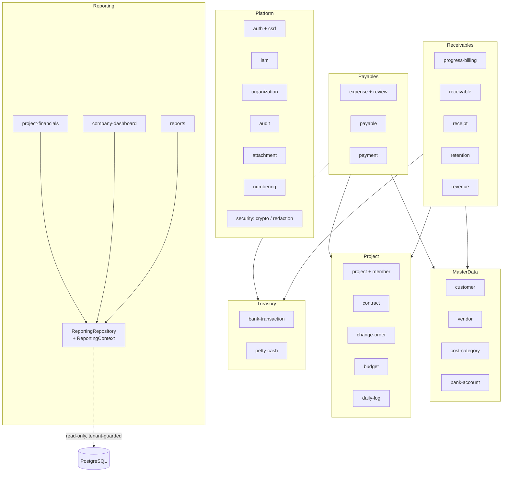
```mermaid
flowchart TB
  subgraph Platform
    AUTH[auth + csrf]
    IAM[iam]
    ORG[organization]
    AUD[audit]
    ATT[attachment]
    SEQ[numbering]
    SEC[security: crypto / redaction]
  end
  subgraph MasterData
    CUS[customer]
    VEN[vendor]
    CC[cost-category]
    BA[bank-account]
  end
  subgraph ProjectCtx[Project]
    PRJ[project + member]
    CON[contract]
    CO[change-order]
    BUD[budget]
    LOG[daily-log]
  end
  subgraph AP[Payables]
    EXP[expense + review]
    PAY[payable]
    PMT[payment]
  end
  subgraph AR[Receivables]
    PB[progress-billing]
    RCV[receivable]
    RCP[receipt]
    RET[retention]
    REV[revenue]
  end
  subgraph Treasury
    BT[bank-transaction]
    PC[petty-cash]
  end
  subgraph Reporting
    RR[ReportingRepository\n+ ReportingContext]
    PF[project-financials]
    CD[company-dashboard]
    RPT[reports]
  end

  AP --> ProjectCtx
  AR --> ProjectCtx
  AP --> MasterData
  AR --> MasterData
  AP --> Treasury
  AR --> Treasury
  PF & CD & RPT --> RR
  RR -. read-only, tenant-guarded .-> PG[(PostgreSQL)]
```

### 3.2 Module 責任與依賴

| Module | 責任 | 擁有的 Entity | 依賴 |
|--------|------|---------------|------|
| `auth` | 登入、登出、refresh rotation、**CSRF token 發行與驗證** | RefreshToken | iam |
| `iam` | 使用者、Membership、Role、Permission、Project scope | User, Membership, Role, Permission, RolePermission | organization |
| `organization` | 組織設定（timezone、TWD、稅率、編號規則） | Organization | — |
| `audit` | Audit log 寫入（含 redaction）與查詢 | AuditLog | security |
| `security` | `CryptoService`、`SensitiveFieldRegistry`、`Redactor` | — | — |
| `attachment` | Presign、上傳確認、檔案驗證、signed URL | Attachment, AttachmentLink | storage adapter |
| `numbering` | 文件編號 | DocumentSequence | — |
| `customer` | 業主 | Customer | — |
| `vendor` | 廠商；銀行帳號加密 | Vendor | security |
| `employee` | 公司人員主檔（可無登入帳號）；代墊款 payee；銀行帳號加密 | Employee | iam (optional userId), security |
| `cost-category` | 成本分類（含適用 scope） | CostCategory | — |
| `bank-account` | 銀行/現金/零用金帳戶 | BankAccount | security |
| `project` | 工程主檔、狀態、成員、實體進度 | Project, ProjectMember | customer, iam, numbering |
| `contract` | 業主合約（MVP 一工程一份 OWNER_CONTRACT） | Contract | project |
| `change-order` | 追加減；核准後重算合約金額；維護 `billedAmount` | ChangeOrder | project, contract |
| `budget` | 工程預算 | ProjectBudget | project, cost-category |
| `daily-log` | 工程日誌、照片 | ProjectDailyLog | project, attachment |
| `expense` | 支出建立、**送審、退回、入帳**、作廢；代墊人 | Expense, ExpenseItem | project, vendor, employee, cost-category, payable |
| `payable` | 應付帳款（payee = Vendor / Employee） | Payable | vendor, employee |
| `payment` | 付款單、分配、**單筆取消分配**、未分配金額、手續費負擔、**支票兌現 / 退票** | Payment, PayablePayment | payable, bank-transaction |
| `progress-billing` | 估驗請款、**追加減請款追溯** | ProgressBilling, ProgressBillingChangeOrder（未來 ProgressBillingItem） | project, change-order, receivable, revenue |
| `receivable` | 應收帳款 | Receivable | customer |
| `receipt` | 收款單、分配、**單筆取消分配**、未分配金額、**支票兌現 / 退票** | Receipt, ReceiptAllocation | receivable, bank-transaction |
| `retention` | 保留款帳 | RetentionRelease | progress-billing, receivable |
| `revenue` | 收入認列（工程款自動、其他收入手動）；1 PB : N RevenueEntry，`sourceKey` 冪等 | RevenueEntry | project |
| `bank-transaction` | 銀行/現金流水 | BankTransaction | bank-account |
| `petty-cash` | 零用金 | PettyCashTransaction | bank-account, expense |
| `reporting` | `ReportingRepository`、`ReportingContext`、project-financials、company-dashboard、reports | — | iam (scope) |

### 3.3 Reporting Tenant Guard

```ts
// modules/reporting/infrastructure/reporting-context.ts
interface ReportingContext {
  readonly organizationId: string;
  readonly projectScope: { kind: 'ALL' } | { kind: 'PROJECTS'; projectIds: readonly string[] };
  readonly includeOverhead: boolean;      // 需 report.overhead.read；scoped user 一律 false
  readonly timezone: string;              // 'Asia/Taipei'
}

// modules/reporting/infrastructure/reporting.repository.ts
abstract class ReportingRepository {
  protected tenantFilter(alias: string, opts: { projectColumn?: string }): Prisma.Sql;
  //  → alias."organizationId" = ${ctx.organizationId}
  //    AND (scope ALL  OR alias."projectId" = ANY(${projectIds}::uuid[]))
  //    AND (includeOverhead OR alias."projectId" IS NOT NULL)
  protected query<T>(ctx: ReportingContext, build: (f: TenantFilterBuilder) => Prisma.Sql): Promise<T[]>;
}
```

規則：

1. `ReportingContext` **只能**由 `ReportingContextFactory.fromRequest(ctx)` 產生（從已驗證的 RequestContext 推導），不接受 client 傳入 organizationId / projectIds。Client 篩選的 projectId 必須是允許 projectIds 的子集，否則 404。
2. 所有 SQL 使用 `Prisma.sql` tagged template（參數化）；**`$queryRawUnsafe` / `$executeRawUnsafe` 全專案禁止**；`$queryRaw` 只允許出現在 `modules/reporting/infrastructure/**`（ESLint `no-restricted-syntax` + boundaries）。
3. 每個 query 中**每個 business table alias** 都必須套用 `tenantFilter`（JOIN 的表也要），reviewer checklist + 測試。
4. **Tenant-leak test**：fixture 建兩個 org、同 org 內兩個 project；每個報表 endpoint 都有測試確認 (a) 他 org 資料不出現；(b) scoped user 看不到非成員工程；(c) scoped user 看不到 OVERHEAD。
5. 未來可加 PostgreSQL RLS 作 defense in depth（不改變本 abstraction）。

### 3.4 財務指標定義（Status Whitelist）

> **規則（ADR-18）**：每個 metric 明確列出允許的 status；實作以 `IN (...)` 常數陣列表達，常數集中於 `packages/shared/src/domain/metric-status.ts`，並有測試確保每個 enum 值都被分類（新增 enum 值時測試失敗，強制決定是否計入）。禁止 `status >= X`、`status != VOID` 這類寫法。

#### 合約

| Metric | 公式 | 允許 status |
|--------|------|-------------|
| `originalContractAmount` | Contract(type=OWNER_CONTRACT).amount | Contract ∈ {SIGNED, COMPLETED} |
| `quotedAmount`（未簽約顯示用） | Contract.amount | Contract ∈ {DRAFT} |
| `approvedAdditions` | Σ ChangeOrder.amount, type=ADDITION | ChangeOrder ∈ {APPROVED} |
| `approvedDeductions` | Σ ChangeOrder.amount, type=DEDUCTION | ChangeOrder ∈ {APPROVED} |
| `currentContractAmount` | original + additions − deductions | 同上 |
| `pendingChangeOrders` | Σ ChangeOrder.amount（signed） | ChangeOrder ∈ {SUBMITTED} |

#### 估驗 / 請款 / 收款 / 收入認列（四者分離）

| Metric | 公式 | 允許 status |
|--------|------|-------------|
| `totalCertified`（累計估驗） | Σ PB.grossAmount + PB.changeOrderAmount | PB ∈ {APPROVED, INVOICED} |
| `billingPendingApproval`（請款審核中） | Σ PB.billingAmount | PB ∈ {SUBMITTED} |
| `totalBilled`（累計請款，未稅） | Σ PB.billingAmount | PB ∈ {INVOICED} |
| `totalBilledWithTax` | Σ Receivable.originalAmount, sourceType=PROGRESS_BILLING | Receivable ∈ {UNPAID, PARTIALLY_PAID, PAID} |
| `totalReceived`（累計收款，已分配，含待兌現票據） | Σ ReceiptAllocation.amount → Receivable(projectId) | ReceiptAllocation.voidedAt IS NULL AND Receipt ∈ {POSTED} AND Receipt.clearingStatus ∈ {NOT_APPLICABLE, PENDING, CLEARED} AND Receivable ∈ {UNPAID, PARTIALLY_PAID, PAID} |
| `totalCashReceived`（累計實收現金） | 同上 | 同上，但 clearingStatus ∈ {NOT_APPLICABLE, CLEARED} |
| `unallocatedReceipts`（未分配收款 / 預收） | Σ Receipt.unallocatedAmount, Receipt.projectId = project | Receipt ∈ {POSTED} AND clearingStatus ∈ {NOT_APPLICABLE, PENDING, CLEARED} |
| `accountsReceivable` | Σ Receivable.outstandingAmount | Receivable ∈ {UNPAID, PARTIALLY_PAID} |
| `overdueReceivable` | 同上 AND dueDate < today(org tz) | Receivable ∈ {UNPAID, PARTIALLY_PAID} |
| `recognizedRevenue`（已認列收入） | Σ RevenueEntry.amount（未稅） | RevenueEntry ∈ {POSTED} |
| `billedProgressPercent` | totalCertified / currentContractAmount × 100 | 同 totalCertified |
| `physicalProgressPercent` | Project.physicalProgressPercent（PM 手填） | — |

#### 保留款

| Metric | 公式 | 允許 status |
|--------|------|-------------|
| `retentionHeld`（累計保留款） | Σ PB.retentionAmount | PB ∈ {APPROVED, INVOICED} |
| `retentionClaimed`（已請領） | Σ RetentionRelease.amount | RetentionRelease ∈ {INVOICED} |
| `retentionUnclaimed`（尚未請領） | retentionHeld − retentionClaimed | 同上 |
| `retentionReceived`（已收回） | Σ ReceiptAllocation → Receivable(sourceType=RETENTION_RELEASE) | ReceiptAllocation.voidedAt IS NULL, Receipt ∈ {POSTED}, clearingStatus ∈ {NOT_APPLICABLE, PENDING, CLEARED}, Receivable ∈ {UNPAID, PARTIALLY_PAID, PAID} |
| `retentionExpectedReleaseDate`（預計退還日） | Project.retentionExpectedReleaseDate；有 RetentionRelease 時取其 expectedReleaseDate | RetentionRelease ∈ {DRAFT, INVOICED} |

#### 成本

| Metric | 公式 | 允許 status |
|--------|------|-------------|
| `budgetCost` | Σ ProjectBudget.budgetAmount | —（未來 BudgetRevision 再加 status） |
| `actualCost`（實際成本） | Σ ExpenseItem.costAmount, Expense.scope=PROJECT | **Expense ∈ {POSTED}**（不含 DRAFT / SUBMITTED / VOID） |
| `pendingReviewCost`（待審成本，僅提示用） | Σ ExpenseItem.costAmount | Expense ∈ {SUBMITTED} |
| `accountsPayable` | Σ Payable.outstandingAmount | Payable ∈ {OPEN, PARTIALLY_PAID} |
| `unallocatedPayments`（未分配付款 / 預付） | Σ Payment.unallocatedAmount, Payment.projectId = project | Payment ∈ {POSTED} AND clearingStatus ∈ {NOT_APPLICABLE, PENDING, CLEARED} |
| `employeeAdvancesPayable`（應付員工代墊） | Σ Payable.outstandingAmount, payeeType=EMPLOYEE | Payable ∈ {OPEN, PARTIALLY_PAID} |
| `variance(category)` | budget − actual | 同 actualCost |
| `estimatedFinalCost` | Σ_category max(budget, actual) | 同 actualCost |

`ExpenseItem.costAmount` 計算（POST 時 snapshot）：
- `documentType = UNIFORM_INVOICE` 且 `inputTaxDeductible = true` → `amount`（未稅）
- 其他（`RECEIPT` / `NONE` / 不可扣抵統一發票）→ `amount + taxAmount`（全額）

#### 損益（兩組命名嚴格分開）

| UI 名稱 | 代號 | 公式 | 說明 |
|---------|------|------|------|
| **預估工程毛利**（Estimated Project Profit） | `estimatedProjectProfit` | currentContractAmount − estimatedFinalCost | 工程完工時的預期毛利 |
| **預估毛利率**（Estimated Margin） | `estimatedMargin` | estimatedProjectProfit / currentContractAmount | currentContract = 0 時回 null |
| **已認列損益**（Recognized Profit） | `recognizedProfit` | recognizedRevenue − actualCost | 依目前已認列收入與已入帳成本；**工程前期常為負值**，UI 需附說明 |
| **已認列毛利率** | `recognizedMargin` | recognizedProfit / recognizedRevenue | recognizedRevenue = 0 時回 null |

> v0.1 的 `actualProfit` 名稱已廢除。Project Card 顯示「預估毛利 %」，工程損益頁兩組並列並以不同區塊呈現。

#### Company Dashboard

| Metric | 定義 | 允許 status |
|--------|------|-------------|
| 施工中工程數 | count Project | Project ∈ {ACTIVE} |
| 本月待收 | Σ Receivable.outstanding, dueDate ∈ 本月 | Receivable ∈ {UNPAID, PARTIALLY_PAID} |
| 本月待付 | Σ Payable.outstanding, dueDate ∈ 本月 | Payable ∈ {OPEN, PARTIALLY_PAID} |
| 逾期應收 | Σ Receivable.outstanding, dueDate < today | Receivable ∈ {UNPAID, PARTIALLY_PAID} |
| 今日待處理 | 待審支出數（有 `expense.post`）、今日到期應收/應付、被退回的我的支出、今日到期支票 | Expense ∈ {SUBMITTED}；我的 Expense ∈ {DRAFT} 且 rejectionReason 非空；Payment/Receipt clearingStatus ∈ {PENDING} 且 checkDueDate = today |
| 銀行 / 現金餘額 | BankAccount.openingBalance + Σ INFLOW − Σ OUTFLOW | BankTransaction ∈ {POSTED}（支票 PENDING 時尚無 BankTransaction，天然排除） |

#### 票據（Cash Flow 用；MVP 定義 metric，報表於 Phase 8 後實作）

| Metric | 定義 | 允許 status |
|--------|------|-------------|
| `pendingChecksPayable`（待兌現應付票據） | Σ Payment.bankOutflowAmount, method=CHECK | Payment ∈ {POSTED} AND clearingStatus ∈ {PENDING} |
| `pendingChecksReceivable`（待兌現應收票據） | Σ Receipt.bankInflowAmount, method=CHECK | Receipt ∈ {POSTED} AND clearingStatus ∈ {PENDING} |
| `bouncedChecks`（退票） | count / Σ 金額 | Payment/Receipt clearingStatus ∈ {BOUNCED} |
| `projectedCashBalance`（預估可用資金） | 銀行餘額 + pendingChecksReceivable − pendingChecksPayable | 同上 |

### 3.5 Payment / Receipt / BankTransaction 金額語意

#### Payee（v0.3）

| 欄位 | 規則 |
|------|------|
| `payeeType` | `VENDOR` \| `EMPLOYEE` |
| `vendorId` / `employeeId` | `VENDOR` → vendorId NOT NULL、employeeId NULL；`EMPLOYEE` → employeeId NOT NULL、vendorId NULL（DB CHECK，Payable 與 Payment 皆同） |
| 單一 payee | 一張 Payment 只能支付一個 payee；所有 allocation 的 Payable 必須與 Payment 同 payee（application rule：建立 allocation 時鎖定 Payment 列並比對；reconciliation job 稽核） |
| Expense 關係 | `Expense.vendorId` = 實際提供商品/服務的供應商；`Expense.advancedByEmployeeId` = 代墊人（nullable）。POST 時：有代墊人 → Payable(payee=EMPLOYEE, employeeId=代墊人)；無 → Payable(payee=VENDOR, vendorId=Expense.vendorId)。後者的一致性由 application rule 保證（不再以 DB composite FK 綁定 Payable.vendorId = Expense.vendorId） |

#### Payment（付款給 Vendor / Employee）

| 欄位 | 定義 | 約束 |
|------|------|------|
| `paymentAmount` | 本次用以清償債務的金額（沖銷 Payable 的基準） | > 0 |
| `allocatedAmount` | Σ PayablePayment.amount WHERE voidedAt IS NULL（cache） | 0 ≤ allocated ≤ paymentAmount |
| `unallocatedAmount` | paymentAmount − allocatedAmount（cache） | ≥ 0；> 0 代表預付 / 尚未沖帳 |
| `feeAmount` | 銀行或支付手續費 | ≥ 0 |
| `feeBearer` | `COMPANY`（default，我方外加負擔）\| `COUNTERPARTY`（payee 負擔，自匯款內扣） | |
| `bankOutflowAmount` | COMPANY：`paymentAmount + feeAmount`；COUNTERPARTY：`paymentAmount` | 我方帳戶實際減少金額 |
| `payeeReceivedAmount` | COMPANY：`paymentAmount`；COUNTERPARTY：`paymentAmount − feeAmount` | payee 實際入帳金額；COUNTERPARTY 時 fee < paymentAmount |

> 範例：應付 100,000，匯費 30。
> COMPANY → 帳戶流出 100,030，廠商實收 100,000，應付沖銷 100,000，財務費用 30。
> COUNTERPARTY → 帳戶流出 100,000，廠商實收 99,970，應付沖銷 100,000，我方無財務費用。

#### Receipt（向業主收款）

| 欄位 | 定義 | 約束 |
|------|------|------|
| `receivedAmount` | 客戶本次清償的總額（沖銷 Receivable 的基準） | > 0 |
| `allocatedAmount` | Σ ReceiptAllocation.amount WHERE voidedAt IS NULL（cache） | 0 ≤ allocated ≤ receivedAmount |
| `unallocatedAmount` | receivedAmount − allocatedAmount（cache） | ≥ 0；> 0 代表訂金 / 預收 / 尚未沖帳 |
| `feeAmount` | 收款時被銀行扣除的手續費 | ≥ 0 |
| `feeBearer` | **MVP 固定 `COMPANY`（BANK_DEDUCTED 語意）**：客戶債務以 receivedAmount 全額清償，手續費由銀行自入帳款內扣，屬我方財務費用。`COUNTERPARTY`（客戶另行負擔，我方全額入帳）僅預留，MVP API 拒絕 | |
| `bankInflowAmount` | COMPANY：`receivedAmount − feeAmount`（fee < receivedAmount）；COUNTERPARTY：`receivedAmount`（且 feeAmount = 0） | 我方帳戶實際增加金額 |

#### Clearing（支票，v0.3）

| method | 建立時 clearingStatus | BankTransaction 建立時點 |
|--------|----------------------|--------------------------|
| CASH / BANK_TRANSFER / PETTY_CASH / CREDIT_CARD / OTHER | `NOT_APPLICABLE` | Payment / Receipt POSTED 時（同 transaction） |
| CHECK | `PENDING` | **`POST /…/:id/clear`（PENDING → CLEARED）時**；PENDING 期間不得存在 BankTransaction |

- 支票開立 / 收受即可 allocation（業界語意：應付帳款轉為應付票據、應收帳款轉為應收票據），因此 Payable / Receivable 的 paid 金額在 PENDING 時已扣減；**實際現金尚未移動**，故不計入銀行餘額，另以 `pendingChecksPayable / pendingChecksReceivable` 呈現。
- **退票（PENDING → BOUNCED）**：同一 transaction 內：① 所有有效 allocation 設 `voidedAt`、`voidReason = 'CHECK_BOUNCED'`；② 重算受影響 Payable / Receivable 的 paid / outstanding / status（回到 OPEN / UNPAID 或 PARTIALLY_PAID）；③ 重算 Payment / Receipt 的 allocated / unallocated；④ 不建立 BankTransaction；⑤ 寫 AuditLog（`BOUNCE` + 每筆 `VOID_ALLOCATION`）。單據本身保留（status 仍為 POSTED、clearingStatus = BOUNCED，為終止狀態），所有 metric whitelist 以 clearingStatus 排除 BOUNCED。重新開票 = 新建一張 Payment / Receipt。
- 退票手續費以手動 BankTransaction（MANUAL）記錄。
- MVP 不支援 CLEARED → BOUNCED（銀行入帳後再退回）；發生時以作廢該單據 + 手動 BankTransaction 處理，列為未來擴充。

#### BankTransaction 對應規則（Treasury 對帳不變式）

| 來源 | 產生的 BankTransaction | 不變式 |
|------|------------------------|--------|
| Payment（實際出帳時點，見 Clearing） | ① OUTFLOW `payeeReceivedAmount`（sourceType=PAYMENT）② 若 fee > 0：OUTFLOW `feeAmount`（sourceType=PAYMENT_FEE） | Σ(sourceId=payment, POSTED) = `bankOutflowAmount`（COMPANY 與 COUNTERPARTY 皆成立） |
| Receipt（實際入帳時點，見 Clearing） | 一筆 INFLOW `bankInflowAmount`（sourceType=RECEIPT） | = `bankInflowAmount` |
| Payment / Receipt → VOID | 對應 BankTransaction 一併 VOID（同 transaction） | 作廢後 Σ = 0 |
| Check PENDING / BOUNCED | 無 BankTransaction | Σ = 0 |
| method = CASH / PETTY_CASH | 寫入 type=CASH / PETTY_CASH 的 BankAccount | 同上 |

- 付款拆兩筆是為了對應台灣銀行對帳單「轉帳 + 手續費」分列；收款手續費通常已內扣，因此只有一筆淨額。
- **手續費歸屬**：Payment(feeBearer=COMPANY) 與 Receipt(feeBearer=COMPANY) 的 `feeAmount` 在報表中歸入 **OVERHEAD 財務費用**，不計入工程 actualCost；COUNTERPARTY 的 fee 不是我方費用。
- **夜間 reconciliation job**：檢查上述不變式、單一 payee 規則、所有 cache 欄位（allocated / unallocated / outstanding / paidAmount），不一致時告警。

#### 未分配收付款與未來演進

| 階段 | 做法 |
|------|------|
| **MVP** | Payment / Receipt 可部分或零分配；`unallocatedAmount` 保留在單據上；可事後 `POST /payments/:id/allocations` 追加分配、`POST /payments/:id/allocations/:allocationId/void` 取消單筆分配；Payment / Receipt 可選填 `projectId` 以標示屬於哪個工程的訂金 / 預付；報表「未分配收款 / 未分配付款」；**預收訂金不自動產生 RevenueEntry**（ADR-33） |
| **Phase 後續：CustomerAdvance / VendorAdvance** | 新增 `CustomerAdvance`（預收工程款、訂金）與 `VendorAdvance`（包商預付款）實體：由 Receipt / Payment 的未分配部分建立（`sourceReceiptId` / `sourcePaymentId`, `amount`, `appliedAmount`, `remainingAmount`），再以 `AdvanceApplication`（advanceId → receivableId / payableId, amount）沖抵 |
| **Migration** | 現有 `unallocatedAmount > 0` 的 Receipt / Payment 一對一轉為 Advance 記錄；ReceiptAllocation / PayablePayment 不變。**屬於新增表，非 breaking** |
| **稅務註記** | 台灣預收工程款通常於收款時即需開立發票；屆時 CustomerAdvance 需連結 invoice 資訊，RevenueEntry 認列時點規則需隨之調整（見 §12 待確認） |

### 3.6 ProgressBilling 與 ChangeOrder 追溯

```
billingAmount        = grossAmount + changeOrderAmount − retentionAmount − deductionAmount
changeOrderAmount    = Σ PBCO.amount (CO.type=ADDITION) − Σ PBCO.amount (CO.type=DEDUCTION)   -- cache，必須等於明細
ChangeOrder.billedAmount = Σ PBCO.amount WHERE PB.status ∈ {DRAFT, SUBMITTED, APPROVED, INVOICED}
CHECK 0 ≤ ChangeOrder.billedAmount ≤ ChangeOrder.amount
```

- `ProgressBillingChangeOrder.amount` 一律為正數（magnitude），正負由 `ChangeOrder.type` 決定。
- 只有 `ChangeOrder.status = APPROVED` 的 CO 可被請款。
- **DRAFT 也佔用額度**（預約），避免兩張草稿同時請同一筆 CO；ProgressBilling VOID 或刪除 DRAFT 時釋放額度。
- **併發控制**：建立/修改 PBCO 時 `SELECT … FROM "ChangeOrder" WHERE id = ANY($ids) FOR UPDATE`，再以 `UPDATE "ChangeOrder" SET "billedAmount" = "billedAmount" + $x WHERE id = $id AND "billedAmount" + $x <= amount`；affected rows = 0 → 422 `CHANGE_ORDER_OVERBILLED`。DB CHECK 為最後防線。
- **未來 `ProgressBillingItem`（詳細估驗工項）**：新增 `ContractItem`（詳細價目表：itemNo, description, unit, quantity, unitPrice, amount）與 `ProgressBillingItem`（progressBillingId, contractItemId, previousCumulativeQty, currentQty, cumulativeQty, currentAmount）。屆時 `grossAmount = Σ ProgressBillingItem.currentAmount`（cache + 驗證），header 欄位語意不變，**非 breaking**。追加減工項可透過 `ContractItem.changeOrderId` 連結。

### 3.7 RevenueEntry 認列冪等（v0.3）

- ProgressBilling **1 : N** RevenueEntry；`progressBillingId` **不設 unique**。
- MVP：PB `INVOICED` 時自動建立**一筆** RevenueEntry，`sourceKey = 'PB_INVOICE:' || progressBillingId`。
- 冪等：`UNIQUE (organizationId, sourceKey) WHERE sourceKey IS NOT NULL AND voidedAt IS NULL`；自動流程以 `INSERT … ON CONFLICT DO NOTHING` 語意處理重試。
- 手動其他收入 / 調整：`sourceKey = NULL`（或 client 提供的 `clientRequestId` 冪等）。
- 未來完工比例法 / 分期認列 / 收入調整：新增 sourceKey 規則（例：`POC:<projectId>:<yyyymm>`、`ADJ:<uuid>`），**不需修改 schema**。

### 3.8 Expense 範圍與審核的 MVP 限制（v0.3）

| 限制 | Domain rule | UI |
|------|-------------|-----|
| 一筆 Expense 只屬於一個 PROJECT 或 OVERHEAD | `scope` + `projectId` 在 header；ExpenseItem **沒有** projectId 欄位；建立 / 修改時 Zod schema 不接受 item 層級的 project | 表單只有一個「工程」欄位；說明文字：「若同一張發票涉及多個工程，請分開登錄」 |
| 未來跨工程分攤 | 新增 `CostAllocation`（expenseId, projectId, costCategoryId, amount）；actualCost 計算改為「有 CostAllocation 時以其為準」 | — |
| 審核單層 | `expense.post` 權限者可將 SUBMITTED → POSTED；無金額門檻、無多層簽核 | 待審佇列只有「入帳 / 退回」 |
| 未來多層審核 | 新增 `ApprovalPolicy`（條件：金額、scope、category）與 `ApprovalStep`（expenseId, stepNo, approverRoleId, decidedAt, decision）；SUBMITTED 狀態內部推進 step，全部通過才 POST；**Expense 欄位與狀態列舉不變** | — |

### 3.9 AuditLog 格式（v0.3 定案）

```json
{
  "schemaVersion": 1,
  "changes": {
    "status":        { "from": "SUBMITTED", "to": "POSTED" },
    "totalAmount":   { "from": "1050.00",   "to": "1050.00" },
    "bankAccountNo": { "from": "[REDACTED]", "to": "[REDACTED]" }
  }
}
```

| 規則 | 內容 |
|------|------|
| 欄位 | `AuditLog.diff JSONB`（上述結構）+ `AuditLog.schemaVersion INT DEFAULT 1` + `metadata JSONB?`（reason、voidReason、clientRequestId 等非欄位資訊） |
| CREATE | 所有初始欄位 `from: null` |
| VOID / 狀態變更 | 只記變動欄位（status、voidedAt、voidReason…） |
| 只記變動 | UPDATE 時 from = to 的欄位不寫入（上例 totalAmount 僅為說明格式） |
| 值序列化 | Decimal → string；DATE → `YYYY-MM-DD`；instant → ISO 8601 UTC；enum → string；null 保留 |
| 子實體 | ExpenseItem、PayablePayment 等子實體各自寫一筆 AuditLog（同 `requestId`），不在父實體 diff 中嵌套陣列 |
| 敏感欄位 | 由 `SensitiveFieldRedactor` 轉為 `{ "from": "[REDACTED]", "to": "[REDACTED]" }`，只表示「有變更」 |
| 版本演進 | 格式變更時 schemaVersion +1；讀取端依版本解析，舊資料不改寫 |

---

## 4. Directory Structure

```
ceproject/
├── apps/
│   ├── web/                                # Next.js (App Router)
│   │   ├── public/
│   │   │   ├── manifest.webmanifest
│   │   │   └── icons/
│   │   ├── src/
│   │   │   ├── app/
│   │   │   │   ├── (auth)/login/page.tsx
│   │   │   │   ├── (app)/                  # AppShell = BottomNav(mobile) / Sidebar(desktop)
│   │   │   │   │   ├── layout.tsx
│   │   │   │   │   ├── page.tsx            # Dashboard
│   │   │   │   │   ├── projects/  expenses/  finance/  billings/
│   │   │   │   │   ├── vendors/  customers/  reports/  documents/
│   │   │   │   │   ├── settings/  me/
│   │   │   │   └── layout.tsx
│   │   │   ├── components/
│   │   │   │   ├── ui/                     # shadcn/ui（無 business logic）
│   │   │   │   ├── shell/                  # AppShell, BottomNav, Sidebar, QuickAddSheet
│   │   │   │   ├── data/                   # ResponsiveList(Table↔Card), EmptyState
│   │   │   │   └── form/                   # MoneyInput, DateField, ProjectPicker, VendorPicker, PhotoCapture, MaskedValue
│   │   │   ├── features/
│   │   │   │   ├── expense/
│   │   │   │   │   ├── api.ts
│   │   │   │   │   ├── drafts/             # Dexie-backed draft repository（Phase 5）
│   │   │   │   │   └── components/         # QuickExpenseForm, ExpenseCard, ReviewQueue
│   │   │   │   ├── project/  billing/  payment/  receipt/  revenue/ ...
│   │   │   ├── lib/
│   │   │   │   ├── api-client.ts           # 統一錯誤解析、401 refresh、自動帶 X-CSRF-Token
│   │   │   │   ├── auth/                   # session hook, <Can>
│   │   │   │   ├── format/                 # money/date display
│   │   │   │   └── offline/
│   │   │   │       ├── db.ts               # Dexie schema（Phase 5 建立，版本化）
│   │   │   │       ├── draft-store.ts      # Phase 5
│   │   │   │       └── sync-queue.ts       # Phase 9
│   │   │   └── styles/globals.css
│   │   ├── Dockerfile
│   │   └── next.config.ts                  # rewrites /api/* → API
│   │
│   └── api/                                # NestJS
│       ├── src/
│       │   ├── main.ts
│       │   ├── app.module.ts
│       │   ├── common/
│       │   │   ├── auth/                   # JwtAuthGuard, @Public, @CurrentUser
│       │   │   ├── csrf/                   # CsrfGuard, Origin check, token service
│       │   │   ├── authz/                  # PermissionGuard, ProjectAccessService, ReferenceGuard
│       │   │   ├── context/                # RequestContext
│       │   │   ├── errors/                 # DomainError, codes, GlobalExceptionFilter
│       │   │   ├── validation/             # ZodValidationPipe（不回傳 received value）
│       │   │   ├── prisma/                 # PrismaService, tx helper
│       │   │   ├── state-machine/          # 通用 transition helper
│       │   │   ├── pagination/
│       │   │   └── idempotency/
│       │   ├── modules/
│       │   │   ├── platform/      auth/ iam/ organization/ audit/ attachment/ numbering/ security/
│       │   │   ├── master-data/   customer/ vendor/ cost-category/ bank-account/
│       │   │   ├── project/       project/ contract/ change-order/ budget/ daily-log/
│       │   │   ├── payables/      expense/ payable/ payment/
│       │   │   ├── receivables/   progress-billing/ receivable/ receipt/ retention/ revenue/
│       │   │   ├── treasury/      bank-transaction/ petty-cash/
│       │   │   └── reporting/
│       │   │       ├── infrastructure/     # ReportingContext(Factory), ReportingRepository, *.report-repository.ts（唯一允許 $queryRaw 之處）
│       │   │       ├── project-financials/
│       │   │       ├── company-dashboard/
│       │   │       └── reports/
│       │   └── infrastructure/
│       │       ├── storage/                # StoragePort + S3StorageAdapter
│       │       └── crypto/                 # KeyProvider（env / KMS adapter）
│       ├── test/                           # integration、tenant-leak、e2e
│       └── Dockerfile
│
├── packages/
│   ├── db/                                 # Prisma（Phase 2 建立）
│   │   ├── prisma/{schema.prisma, migrations/, seed.ts}
│   │   └── src/index.ts
│   ├── contracts/                          # Zod API contracts（FE+BE）
│   ├── shared/
│   │   └── src/
│   │       ├── money/  date/
│   │       ├── domain/                     # billing formula, contract amount, margin, metric-status whitelists, state machines（純定義）
│   │       ├── enums/
│   │       └── permissions/
│   └── config/  eslint/ tsconfig/ vitest/
│
├── docs/
│   ├── ARCHITECTURE.md
│   ├── adr/
│   └── domain-glossary.md
├── docker-compose.yml                      # postgres, minio, mailpit, (web, api for self-host)
├── .github/workflows/ci.yml
├── turbo.json
├── pnpm-workspace.yaml
├── package.json
└── .env.example
```

---

## 5. Initial Database ERD

### 5.1 共用欄位慣例

| 欄位 | 型別 | 說明 |
|------|------|------|
| `id` | UUID（傾向 v7） | 不使用流水號 |
| `organizationId` | UUID FK | 所有 business data；unique 皆含 orgId |
| `createdAt` / `updatedAt` | TIMESTAMPTZ | |
| `createdById` / `updatedById?` | UUID FK → User | |
| `version` | Int | 帳務文件樂觀鎖 |
| `voidedAt` / `voidedById` / `voidReason` | | 作廢 |
| `archivedAt` | TIMESTAMPTZ? | Master data 停用 |
| `clientRequestId` | UUID? | `@@unique([organizationId, clientRequestId])` |

### 5.2 IAM / Organization

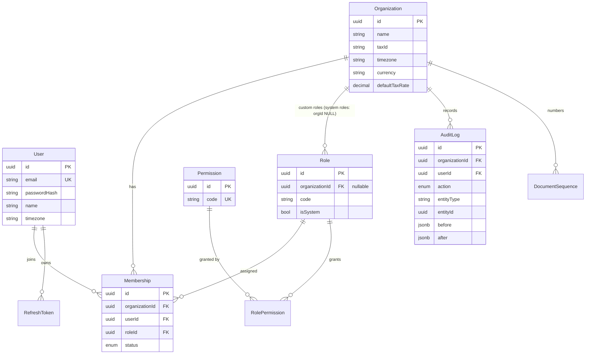
```mermaid
erDiagram
  Organization ||--o{ Membership : has
  User ||--o{ Membership : joins
  Role ||--o{ Membership : assigned
  Organization ||--o{ Role : "custom roles (system roles: orgId NULL)"
  Role ||--o{ RolePermission : grants
  Permission ||--o{ RolePermission : "granted by"
  User ||--o{ RefreshToken : owns
  Organization ||--o{ AuditLog : records
  Organization ||--o{ DocumentSequence : numbers

  Organization { uuid id PK  string name  string taxId  string timezone  string currency  decimal defaultTaxRate }
  User { uuid id PK  string email UK  string passwordHash  string name  string timezone }
  Membership { uuid id PK  uuid organizationId FK  uuid userId FK  uuid roleId FK  enum status }
  Role { uuid id PK  uuid organizationId FK "nullable"  string code  bool isSystem }
  Permission { uuid id PK  string code UK }
  AuditLog { uuid id PK  uuid organizationId FK  uuid userId FK  enum action  string entityType  uuid entityId  jsonb before  jsonb after }
```

### 5.3 Project / Contract / Budget

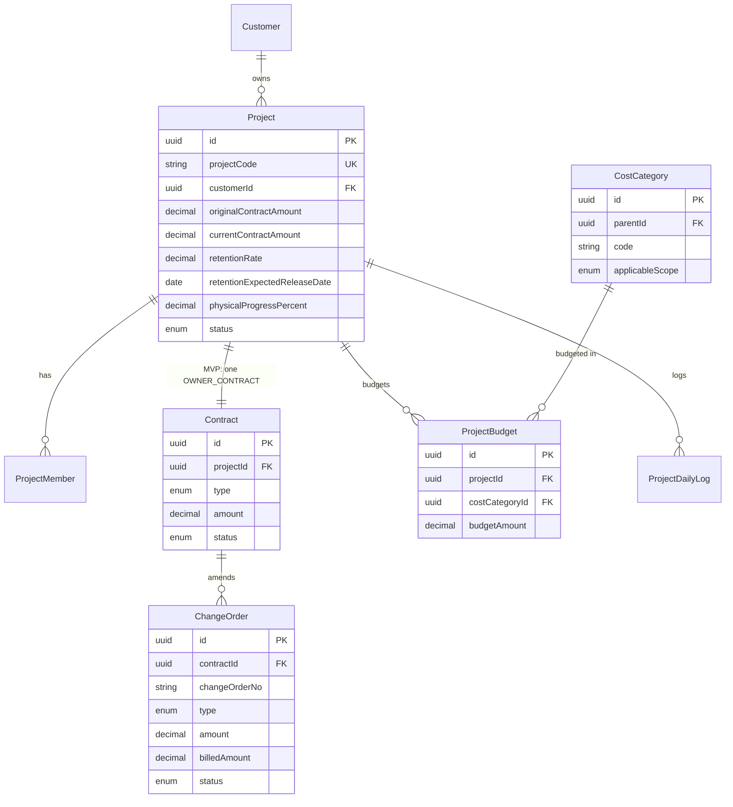
```mermaid
erDiagram
  Customer ||--o{ Project : owns
  Project ||--o{ ProjectMember : has
  Project ||--|| Contract : "MVP: one OWNER_CONTRACT"
  Contract ||--o{ ChangeOrder : amends
  Project ||--o{ ProjectBudget : budgets
  CostCategory ||--o{ ProjectBudget : "budgeted in"
  Project ||--o{ ProjectDailyLog : logs

  Project { uuid id PK  string projectCode UK  uuid customerId FK  decimal originalContractAmount  decimal currentContractAmount  decimal retentionRate  date retentionExpectedReleaseDate  decimal physicalProgressPercent  enum status }
  Contract { uuid id PK  uuid projectId FK  enum type  decimal amount  enum status }
  ChangeOrder { uuid id PK  uuid contractId FK  string changeOrderNo  enum type  decimal amount  decimal billedAmount  enum status }
  ProjectBudget { uuid id PK  uuid projectId FK  uuid costCategoryId FK  decimal budgetAmount }
  CostCategory { uuid id PK  uuid parentId FK  string code  enum applicableScope }
```

### 5.4 Payables（成本端 + 管銷）

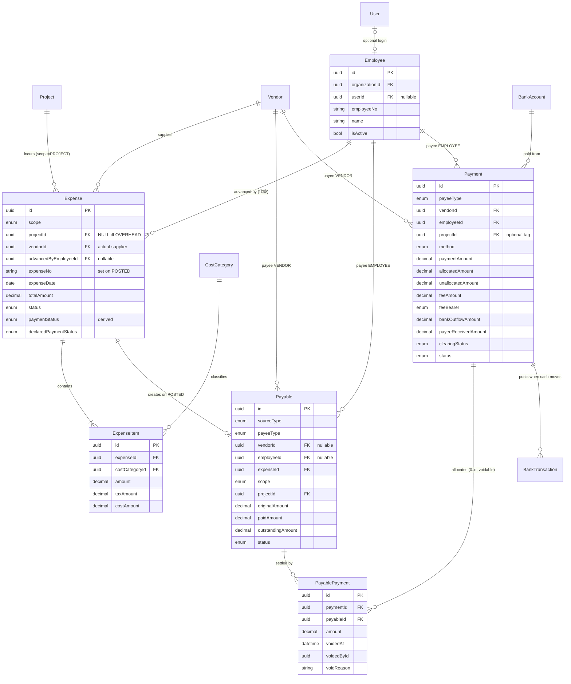
```mermaid
erDiagram
  Project ||--o{ Expense : "incurs (scope=PROJECT)"
  Vendor ||--o{ Expense : supplies
  Employee ||--o{ Expense : "advanced by (代墊)"
  User |o--o| Employee : "optional login"
  Expense ||--|{ ExpenseItem : contains
  CostCategory ||--o{ ExpenseItem : classifies
  Expense ||--o| Payable : "creates on POSTED"
  Vendor ||--o{ Payable : "payee VENDOR"
  Employee ||--o{ Payable : "payee EMPLOYEE"
  Vendor ||--o{ Payment : "payee VENDOR"
  Employee ||--o{ Payment : "payee EMPLOYEE"
  Payment ||--o{ PayablePayment : "allocates (0..n, voidable)"
  Payable ||--o{ PayablePayment : "settled by"
  BankAccount ||--o{ Payment : "paid from"
  Payment ||--o{ BankTransaction : "posts when cash moves"

  Employee { uuid id PK  uuid organizationId FK  uuid userId FK "nullable"  string employeeNo  string name  bool isActive }
  Expense { uuid id PK  enum scope  uuid projectId FK "NULL iff OVERHEAD"  uuid vendorId FK "actual supplier"  uuid advancedByEmployeeId FK "nullable"  string expenseNo "set on POSTED"  date expenseDate  decimal totalAmount  enum status  enum paymentStatus "derived"  enum declaredPaymentStatus }
  ExpenseItem { uuid id PK  uuid expenseId FK  uuid costCategoryId FK  decimal amount  decimal taxAmount  decimal costAmount }
  Payable { uuid id PK  enum sourceType  enum payeeType  uuid vendorId FK "nullable"  uuid employeeId FK "nullable"  uuid expenseId FK  enum scope  uuid projectId FK  decimal originalAmount  decimal paidAmount  decimal outstandingAmount  enum status }
  Payment { uuid id PK  enum payeeType  uuid vendorId FK  uuid employeeId FK  uuid projectId FK "optional tag"  enum method  decimal paymentAmount  decimal allocatedAmount  decimal unallocatedAmount  decimal feeAmount  enum feeBearer  decimal bankOutflowAmount  decimal payeeReceivedAmount  enum clearingStatus  enum status }
  PayablePayment { uuid id PK  uuid paymentId FK  uuid payableId FK  decimal amount  datetime voidedAt  uuid voidedById  string voidReason }
```

### 5.5 Receivables（收入端）

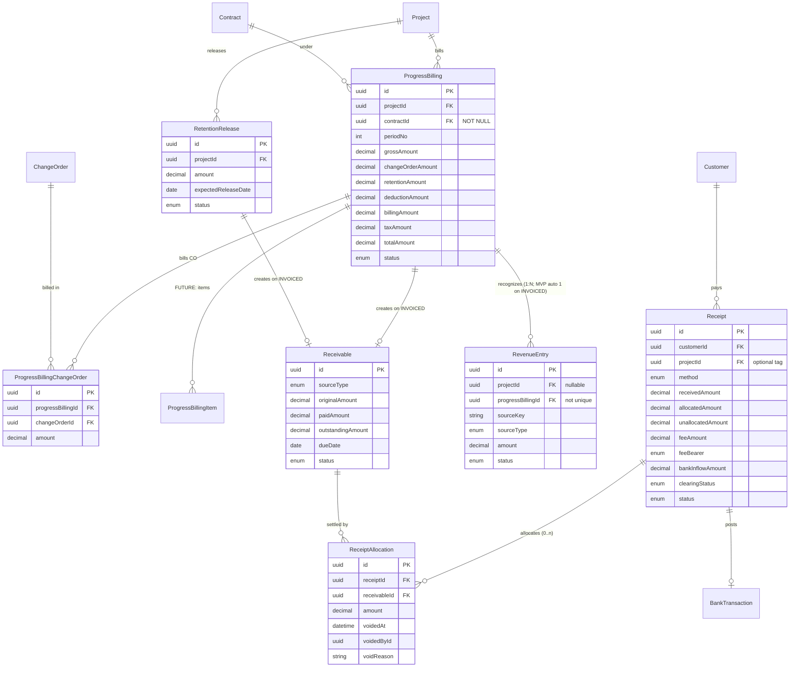
```mermaid
erDiagram
  Project ||--o{ ProgressBilling : bills
  Contract ||--o{ ProgressBilling : under
  ProgressBilling ||--o{ ProgressBillingChangeOrder : "bills CO"
  ChangeOrder ||--o{ ProgressBillingChangeOrder : "billed in"
  ProgressBilling ||--o{ ProgressBillingItem : "FUTURE: items"
  ProgressBilling ||--o| Receivable : "creates on INVOICED"
  ProgressBilling ||--o{ RevenueEntry : "recognizes (1:N; MVP auto 1 on INVOICED)"
  Project ||--o{ RetentionRelease : releases
  RetentionRelease ||--o| Receivable : "creates on INVOICED"
  Customer ||--o{ Receipt : pays
  Receipt ||--o{ ReceiptAllocation : "allocates (0..n)"
  Receivable ||--o{ ReceiptAllocation : "settled by"
  Receipt ||--o| BankTransaction : posts

  ProgressBilling { uuid id PK  uuid projectId FK  uuid contractId FK "NOT NULL"  int periodNo  decimal grossAmount  decimal changeOrderAmount  decimal retentionAmount  decimal deductionAmount  decimal billingAmount  decimal taxAmount  decimal totalAmount  enum status }
  ProgressBillingChangeOrder { uuid id PK  uuid progressBillingId FK  uuid changeOrderId FK  decimal amount }
  Receivable { uuid id PK  enum sourceType  decimal originalAmount  decimal paidAmount  decimal outstandingAmount  date dueDate  enum status }
  Receipt { uuid id PK  uuid customerId FK  uuid projectId FK "optional tag"  enum method  decimal receivedAmount  decimal allocatedAmount  decimal unallocatedAmount  decimal feeAmount  enum feeBearer  decimal bankInflowAmount  enum clearingStatus  enum status }
  ReceiptAllocation { uuid id PK  uuid receiptId FK  uuid receivableId FK  decimal amount  datetime voidedAt  uuid voidedById  string voidReason }
  RetentionRelease { uuid id PK  uuid projectId FK  decimal amount  date expectedReleaseDate  enum status }
  RevenueEntry { uuid id PK  uuid projectId FK "nullable"  uuid progressBillingId FK "not unique"  string sourceKey  enum sourceType  decimal amount  enum status }
```

### 5.6 Treasury / Attachment / Vendor 敏感欄位

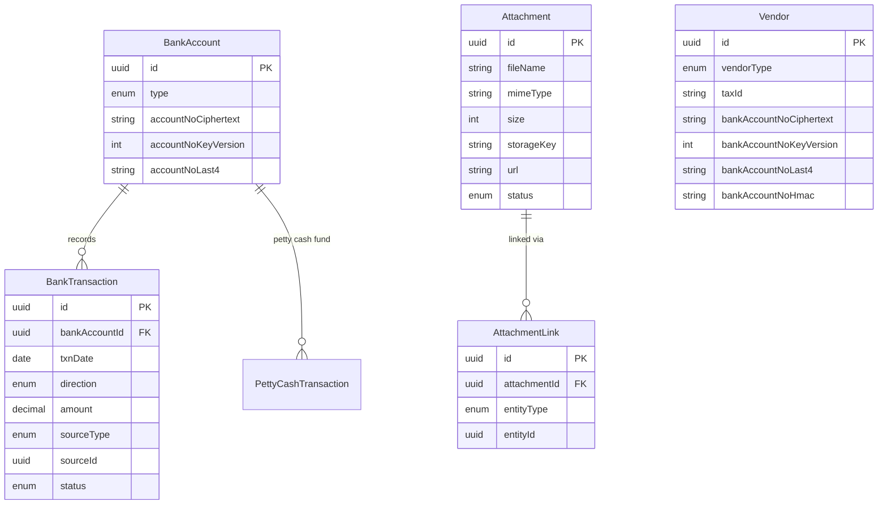
```mermaid
erDiagram
  BankAccount ||--o{ BankTransaction : records
  BankAccount ||--o{ PettyCashTransaction : "petty cash fund"
  Attachment ||--o{ AttachmentLink : "linked via"

  Vendor { uuid id PK  enum vendorType  string taxId  string bankAccountNoCiphertext  int bankAccountNoKeyVersion  string bankAccountNoLast4  string bankAccountNoHmac }
  BankAccount { uuid id PK  enum type  string accountNoCiphertext  int accountNoKeyVersion  string accountNoLast4 }
  BankTransaction { uuid id PK  uuid bankAccountId FK  date txnDate  enum direction  decimal amount  enum sourceType  uuid sourceId  enum status }
  Attachment { uuid id PK  string fileName  string mimeType  int size  string storageKey  string url  enum status }
  AttachmentLink { uuid id PK  uuid attachmentId FK  enum entityType  uuid entityId }
```

---

## 6. Prisma Models、Relationships 與 DB Integrity

> Phase 2 Schema 的設計規格（**非程式碼**）。`[C]` = 共用欄位；`[V]` = 作廢欄位；`[L]` = `version`；🆕 = v0.2 新增/修改。

### 6.1 Enums

```prisma
enum MembershipStatus      { INVITED ACTIVE SUSPENDED }
enum ProjectStatus         { DRAFT QUOTATION ACTIVE PAUSED INSPECTION COMPLETED CLOSED }
enum ProjectMemberRole     { MANAGER SITE_MANAGER MEMBER }
enum VendorType            { SUPPLIER SUBCONTRACTOR WORKER OTHER }
enum ContractType          { OWNER_CONTRACT SUBCONTRACT }            // MVP 只建立 OWNER_CONTRACT
enum ContractStatus        { DRAFT SIGNED TERMINATED COMPLETED }
enum ChangeOrderType       { ADDITION DEDUCTION }
enum ChangeOrderStatus     { DRAFT SUBMITTED APPROVED REJECTED CANCELLED }
enum ExpenseScope          { PROJECT OVERHEAD }                      // 🆕
enum ExpenseStatus         { DRAFT SUBMITTED POSTED VOID }           // 🆕（取代 DocumentStatus）
enum CostCategoryScope     { PROJECT OVERHEAD BOTH }                 // 🆕
enum PaymentStatus         { UNPAID PARTIALLY_PAID PAID }            // Expense 衍生狀態 / 現場申報狀態
enum PayableSource         { EXPENSE MANUAL }                        // 🆕 未來：SUBCONTRACT_BILLING, RETENTION
enum PayeeType             { VENDOR EMPLOYEE }                       // v0.3
enum FeeBearer             { COMPANY COUNTERPARTY }                  // v0.3
enum ClearingStatus        { NOT_APPLICABLE PENDING CLEARED BOUNCED } // v0.3
enum PayableStatus         { OPEN PARTIALLY_PAID PAID VOID }
enum ReceivableStatus      { UNPAID PARTIALLY_PAID PAID OVERDUE VOID }  // OVERDUE 保留但不持久化（見 TD-12）
enum ReceivableSource      { PROGRESS_BILLING RETENTION_RELEASE OTHER }
enum SettlementStatus      { POSTED VOID }                           // 🆕 Payment / Receipt
enum PaymentMethod         { CASH BANK_TRANSFER CHECK CREDIT_CARD PETTY_CASH OTHER }
enum ExpenseDocType        { UNIFORM_INVOICE RECEIPT NONE }
enum ProgressBillingStatus { DRAFT SUBMITTED APPROVED INVOICED VOID }
enum RetentionReleaseStatus{ DRAFT INVOICED VOID }                   // 🆕 簡化
enum RevenueSource         { PROGRESS_BILLING OTHER_INCOME MANUAL_ADJUSTMENT }
enum RevenueStatus         { POSTED VOID }                           // 🆕
enum BankAccountType       { BANK CASH PETTY_CASH }
enum TxnDirection          { INFLOW OUTFLOW }
enum BankTxnSource         { PAYMENT PAYMENT_FEE RECEIPT PETTY_CASH TRANSFER MANUAL }  // 🆕 PAYMENT_FEE
enum BankTxnStatus         { POSTED VOID }
enum PettyCashTxnType      { REPLENISH SPEND RETURN ADJUST }
enum AttachmentStatus      { PENDING UPLOADED REJECTED }
enum AttachableType        { EXPENSE PAYMENT RECEIPT PROGRESS_BILLING CHANGE_ORDER CONTRACT PROJECT DAILY_LOG VENDOR CUSTOMER REVENUE_ENTRY }
enum AttachmentPurpose     { INVOICE RECEIPT_PHOTO CONTRACT_DOC SITE_PHOTO OTHER }
enum AuditAction           { CREATE UPDATE DELETE_DRAFT SUBMIT RETURN POST APPROVE REJECT INVOICE VOID CANCEL ALLOCATE VOID_ALLOCATION CLEAR BOUNCE STATUS_CHANGE REVEAL_SENSITIVE LOGIN PERMISSION_CHANGE }  // v0.3 加 VOID_ALLOCATION / CLEAR / BOUNCE
```

### 6.2 Models

#### Platform

| Model | 主要欄位 | Relations / Constraints |
|-------|----------|-------------------------|
| **Organization** | id, name, taxId?, timezone=`Asia/Taipei`, currency=`TWD`, defaultTaxRate=`0.0500`, allowDecimalAmounts=false 🆕, lockedUntilDate?, createdAt, updatedAt | |
| **User** | id, email (unique, lowercase), passwordHash, name, phone?, timezone?, isActive, lastLoginAt? | 無 organizationId；透過 Membership 支援多組織（MVP UI 不開放切換） |
| **Membership** | [C], userId, roleId, status | `@@unique([organizationId, userId])` |
| **Role** | id, organizationId?, code, name, isSystem | 🆕 **partial unique index**（見 §6.4）；Prisma `@@unique([organizationId, code])` 不足以約束 NULL |
| **Permission** | id, code (unique), module, description | Seed 維護 |
| **RolePermission** | roleId, permissionId | `@@id([roleId, permissionId])` |
| **RefreshToken** | id, userId, tokenHash, familyId, expiresAt, revokedAt?, replacedById? | |
| **AuditLog** | id, organizationId, userId?, action, entityType, entityId, **diff Json（§3.9 格式，redacted）, schemaVersion Int default 1**, metadata Json?, requestId, createdAt | Append-only（REVOKE UPDATE/DELETE）；v0.3 以 diff 取代 before/after 欄位 |
| **DocumentSequence** | organizationId, docType, year, lastNumber | `@@id([organizationId, docType, year])` |
| **Attachment** | [C], fileName, mimeType, size, storageKey (unique), url?, checksum, status, uploadedById | |
| **AttachmentLink** | id, organizationId, attachmentId, entityType, entityId, purpose | `@@index([organizationId, entityType, entityId])` |

#### Master Data

| Model | 主要欄位 | Relations / Constraints |
|-------|----------|-------------------------|
| **Customer** | [C], name, taxId?, contactName?, phone?, email?, address?, note?, archivedAt? | |
| **Vendor** 🆕 | [C], vendorType, name, taxId?, contactName?, phone?, email?, address?, paymentTerms?, paymentTermDays?, bankCode?, bankBranch?, bankAccountName?, **bankAccountNoCiphertext?, bankAccountNoKeyVersion?, bankAccountNoLast4?, bankAccountNoHmac?**, note?, archivedAt? | 不存在明文 `bankAccountNo` 欄位；CHECK：ciphertext 與 keyVersion、last4 同時為 NULL 或同時非 NULL |
| **Employee** (v0.3) | id, organizationId, userId? (unique per org), employeeNo?, name, phone?, email?, bankCode?, bankAccountName?, bankAccountNoCiphertext?/KeyVersion?/Last4?（代墊匯款用，加密規則同 Vendor）, isActive, createdAt, updatedAt, createdById | `@@unique([organizationId, employeeNo])`（partial：employeeNo 非空）；`@@unique([organizationId, userId])`（partial：userId 非空）；**User = 登入帳號、Employee = 人員主檔，Employee 可無 userId**；MVP 無薪資欄位 |
| **CostCategory** 🆕 | [C], parentId?, code, name, applicableScope, sortOrder, isActive | `@@unique([organizationId, code])`；Seed：工程類（材料/工資/分包/機具/運費/雜支）＋管銷類（租金/水電/薪資/保險/財務費用/其他） |
| **BankAccount** 🆕 | [C], type, name, bankName?, branch?, **accountNoCiphertext?, accountNoKeyVersion?, accountNoLast4?**, currency, openingBalance, openingDate, isActive | |

#### Project

| Model | 主要欄位 | Relations / Constraints |
|-------|----------|-------------------------|
| **Project** 🆕 | [C][L], projectCode, name, customerId, address?, projectManagerId?, startDate?, expectedEndDate?, actualEndDate?, originalContractAmount (cache), currentContractAmount (cache), retentionRate, **retentionExpectedReleaseDate?**, **physicalProgressPercent? Decimal(5,2), physicalProgressUpdatedAt?**, status, note? | `@@unique([organizationId, projectCode])`；CHECK `physicalProgressPercent BETWEEN 0 AND 100` |
| **ProjectMember** | projectId, userId, organizationId, projectRole | `@@id([projectId, userId])` |
| **Contract** | [C][L], projectId, contractNo, type, title, signedDate?, amount, taxAmount, retentionRate?, status | 🆕 MVP：**partial unique `(projectId) WHERE type = 'OWNER_CONTRACT' AND status <> 'TERMINATED'`**（一工程一份有效業主合約；未來放寬只需移除 index） |
| **ChangeOrder** 🆕 | [C][L], projectId, contractId, changeOrderNo, type, description, amount (>0), **billedAmount (cache, default 0)**, requestDate, approvalDate?, approvedById?, status | `@@unique([organizationId, projectId, changeOrderNo])`；CHECK `billedAmount BETWEEN 0 AND amount`；APPROVED 後金額不可修改 |
| **ProjectBudget** | [C], projectId, costCategoryId, budgetAmount, note? | `@@unique([projectId, costCategoryId])`；costCategory.applicableScope ∈ {PROJECT, BOTH}（app validation） |
| **ProjectDailyLog** | [C], projectId, logDate, weather?, workerCount?, content, clientRequestId? | |

#### Payables

| Model | 主要欄位 | Relations / Constraints |
|-------|----------|-------------------------|
| **Expense** 🆕 | [C][V][L], **scope**, projectId?, vendorId?（實際供應商）, **advancedByEmployeeId?（v0.3 代墊人）**, **expenseNo?（POSTED 時配號）**, expenseDate, costCategoryId（主分類）, subtotalAmount, taxAmount, totalAmount, documentType, **inputTaxDeductible**, documentNumber?, **status (DRAFT/SUBMITTED/POSTED/VOID)**, **submittedAt?, submittedById?, reviewedAt?, reviewedById?, reviewNote?, rejectionReason?, postedAt?, postedById?**, paymentStatus? (derived，POSTED 後才有值), **declaredPaymentStatus?, declaredPaidAmount?, declaredPaymentMethod?**（現場申報，供會計入帳時參考）, dueDate?, note?, clientRequestId? | 見 §6.4 CHECK 清單；1:N ExpenseItem；1:0..1 Payable |
| **ExpenseItem** 🆕 | id, organizationId, expenseId, costCategoryId, description?, quantity?, unit?, unitPrice?, amount, taxAmount, **costAmount（POSTED 時 snapshot）**, sortOrder | 成本報表以 ExpenseItem 彙總 |
| **Payable** (v0.3) | [C][L], sourceType, **payeeType, vendorId?, employeeId?**, expenseId? (unique), scope, projectId?, payableNo, originalAmount, paidAmount (cache), outstandingAmount (cache), dueDate?, status | CHECK `paid + outstanding = original`、`0 ≤ paid ≤ original`；payee CHECK（I-07）；scope/projectId 與 Expense 一致；payee 與 Expense 的對應為 application rule（§3.5 Payee） |
| **Payment** (v0.3) | [C][V][L], **payeeType, vendorId?, employeeId?**, projectId?, bankAccountId, paymentNo, paymentDate, method, paymentAmount, allocatedAmount (cache), unallocatedAmount (cache), feeAmount, **feeBearer (default COMPANY)**, bankOutflowAmount (cache), **payeeReceivedAmount (cache)**, **clearingStatus, clearedAt?, clearedById?, clearedDate?, bouncedAt?, bouncedById?, bounceReason?**, checkNo?, checkDueDate?, withholdingAmount = 0（預留）, note?, clientRequestId?, status (SettlementStatus) | CHECK 見 §6.4；所有有效 allocation 的 Payable 必須同 payee（application rule） |
| **PayablePayment** (v0.3) | id, organizationId, paymentId, payableId, amount (>0), createdAt, createdById, **voidedAt?, voidedById?, voidReason?** | **partial unique `(paymentId, payableId) WHERE voidedAt IS NULL`**；同一有效 pair 追加分配時累加 amount；取消後可重新建立新 allocation（舊列保留稽核） |
| **PettyCashTransaction** | [C][V], bankAccountId, custodianId, type, txnDate, amount, expenseId?, description? | |

#### Receivables

| Model | 主要欄位 | Relations / Constraints |
|-------|----------|-------------------------|
| **ProgressBilling** 🆕 | [C][V][L], projectId, **contractId (NOT NULL)**, periodNo, billingNo, grossAmount, **changeOrderAmount (cache = Σ PBCO, signed)**, retentionAmount, deductionAmount, deductionNote?, billingAmount, taxAmount, totalAmount, cumulativeGrossAmount?, billingDate, invoiceDate?, invoiceNumber?, dueDate?, expectedPaymentDate?, approvedAmount?, submittedAt?, approvedAt?, invoicedAt?, status | `@@unique([projectId, periodNo])`；CHECK `billingAmount = gross + changeOrderAmount − retention − deduction`、`totalAmount = billingAmount + taxAmount` |
| **ProgressBillingChangeOrder** 🆕 | id, organizationId, progressBillingId, changeOrderId, amount (>0), note?, createdAt, createdById | `@@unique([progressBillingId, changeOrderId])`；CO 必須 APPROVED 且同 project；額度控制見 §3.6 |
| **ProgressBillingItem** 🔮 | （未來）progressBillingId, contractItemId, previousCumulativeQty, currentQty, cumulativeQty, unitPrice, currentAmount | **MVP 不建立**；擴充方向見 §3.6 |
| **RetentionRelease** 🆕 | [C][V], projectId, requestDate, amount, expectedReleaseDate?, invoiceDate?, invoiceNumber?, status (DRAFT/INVOICED/VOID), note? | amount ≤ retentionUnclaimed（app validation + row lock on Project） |
| **Receivable** | [C][L], customerId, projectId?, sourceType, progressBillingId? (unique), retentionReleaseId? (unique), receivableNo, originalAmount, paidAmount, outstandingAmount, dueDate?, status | CHECK 同 Payable；CHECK sourceType 與來源 FK 對應 |
| **Receipt** (v0.3) | [C][V][L], customerId, projectId?, bankAccountId, receiptNo, receiptDate, method, receivedAmount, allocatedAmount (cache), unallocatedAmount (cache), feeAmount, **feeBearer (MVP 固定 COMPANY)**, bankInflowAmount (cache), **clearingStatus, clearedAt?, clearedById?, clearedDate?, bouncedAt?, bouncedById?, bounceReason?**, checkNo?, checkBank?, checkDueDate?, note?, clientRequestId?, status | CHECK 見 §6.4 |
| **ReceiptAllocation** (v0.3) | id, organizationId, receiptId, receivableId, amount (>0), createdAt, createdById, **voidedAt?, voidedById?, voidReason?** | **partial unique `(receiptId, receivableId) WHERE voidedAt IS NULL`** |
| **RevenueEntry** (v0.3) | [C][V], projectId?, progressBillingId?（**不 unique**）, **sourceKey?**, sourceType, recognitionDate, amount（未稅）, taxAmount, description?, clientRequestId?, status (POSTED/VOID) | ProgressBilling 1:N；`UNIQUE (organizationId, sourceKey) WHERE sourceKey IS NOT NULL AND voidedAt IS NULL`；sourceType=PROGRESS_BILLING ⇔ progressBillingId 非空（CHECK） |

#### Treasury

| Model | 主要欄位 | Relations / Constraints |
|-------|----------|-------------------------|
| **BankTransaction** 🆕 | [C][V], bankAccountId, txnDate, direction, amount (>0), sourceType（含 PAYMENT_FEE）, sourceId?, counterparty?, description?, externalRef?, status | `@@index([bankAccountId, txnDate])`；`@@index([organizationId, sourceType, sourceId])` |

### 6.3 關鍵 Relationship 規則

1. **Expense → Payable（1 : 0..1）**：**只有 POSTED** 時建立 Payable（MVP 每筆 POSTED Expense 都建立 Payable，即使已現場付清）。Payee：有 `advancedByEmployeeId` → EMPLOYEE，否則 VENDOR（= Expense.vendorId）。會計入帳時若 `declaredPaymentStatus = PAID` 且非代墊，可於同一 transaction 建立 Payment（從指定現金 / 零用金 / 銀行帳戶）並完全分配；代墊則保留 Payable 待日後付款給員工。
2. **Expense.paymentStatus 由 Payable 推導**：OPEN→UNPAID、PARTIALLY_PAID→PARTIALLY_PAID、PAID→PAID；DRAFT / SUBMITTED 時為 NULL（只顯示 declaredPaymentStatus）。
3. **Expense VOID** 前置條件：Payable 無有效分配（allocated = 0）；否則需先作廢相關 Payment。作廢時 Payable 一併 VOID。
4. **Payable ↔ Payment（N:M via PayablePayment）**：允許未分配；追加分配與單筆取消走 allocation endpoints；同一 Payment 所有有效 allocation 必須同 payee。取消 allocation 同 transaction 重算 Payment allocated/unallocated、Payable paid/outstanding/status、Expense.paymentStatus，並寫 AuditLog（`VOID_ALLOCATION`）。Receipt ↔ Receivable 同理。
5. **ProgressBilling → Receivable / RevenueEntry**：`INVOICED` 時同 transaction 建立 Receivable（totalAmount 含稅）與一筆 RevenueEntry（billingAmount 未稅，`sourceKey` 冪等）。
6. **ProgressBilling ↔ ChangeOrder（N:M via ProgressBillingChangeOrder）**：維護 `ChangeOrder.billedAmount`。
7. **Retention**：PB 扣留 → RetentionRelease(INVOICED) → Receivable(RETENTION_RELEASE)。
8. **ChangeOrder APPROVED / CANCELLED → Project.currentContractAmount 重算**。
9. **跨 organization reference**：所有 FK 參照由 `ReferenceGuard` 驗證屬同 org（application layer）；財務核心表另以 composite FK 在 DB 層保證（§6.5）。

### 6.4 DB Integrity 規格（Phase 2 必須實作）

Prisma schema 無法表達的約束以 **raw SQL migration** 加入，並於 `packages/db/prisma/constraints.md` 列冊；每條約束需有 integration test 驗證違反時會失敗。

| # | 約束 | 實作 |
|---|------|------|
| I-01 | PayablePayment 有效 pair 唯一 (v0.3) | `CREATE UNIQUE INDEX … ON "PayablePayment"("paymentId","payableId") WHERE "voidedAt" IS NULL` |
| I-02 | ReceiptAllocation 有效 pair 唯一 (v0.3) | `CREATE UNIQUE INDEX … ON "ReceiptAllocation"("receiptId","receivableId") WHERE "voidedAt" IS NULL` |
| I-03 | 系統 Role code 唯一 | `CREATE UNIQUE INDEX role_system_code_uq ON "Role"(code) WHERE "organizationId" IS NULL;` |
| I-04 | 組織 Role code 唯一 | `CREATE UNIQUE INDEX role_org_code_uq ON "Role"("organizationId", code) WHERE "organizationId" IS NOT NULL;` |
| I-05 | ExpenseScope 規則 | `CHECK ((scope = 'PROJECT' AND "projectId" IS NOT NULL) OR (scope = 'OVERHEAD' AND "projectId" IS NULL))`（Expense、Payable 皆加） |
| I-06 | POSTED Expense 必有 vendor | `CHECK (status NOT IN ('POSTED','VOID') OR "vendorId" IS NOT NULL)`（VOID 前必曾 POSTED） |
| I-07 | Payee 規則 (v0.3，取代 v0.2 的 Payable↔Expense vendor composite FK) | Payable 與 Payment：`CHECK (("payeeType" = 'VENDOR' AND "vendorId" IS NOT NULL AND "employeeId" IS NULL) OR ("payeeType" = 'EMPLOYEE' AND "employeeId" IS NOT NULL AND "vendorId" IS NULL))`；Payable.vendorId = Expense.vendorId（VENDOR 時）、Payable.employeeId = Expense.advancedByEmployeeId（EMPLOYEE 時）為 application rule |
| I-08 | Expense 狀態欄位一致 | `CHECK (status <> 'SUBMITTED' OR ("submittedAt" IS NOT NULL AND "submittedById" IS NOT NULL))`；`CHECK (status NOT IN ('POSTED','VOID') OR ("postedAt" IS NOT NULL AND "expenseNo" IS NOT NULL))`；`CHECK (status <> 'VOID' OR "voidedAt" IS NOT NULL)` |
| I-09 | Expense 金額 | `CHECK ("totalAmount" = "subtotalAmount" + "taxAmount")`、各金額 ≥ 0 |
| I-10 | Payable / Receivable 金額 | `CHECK ("paidAmount" + "outstandingAmount" = "originalAmount" AND "paidAmount" >= 0 AND "outstandingAmount" >= 0)` |
| I-11 | Payment 金額 (v0.3 依 feeBearer) | `CHECK ("paymentAmount" > 0 AND "allocatedAmount" >= 0 AND "unallocatedAmount" >= 0 AND "allocatedAmount" + "unallocatedAmount" = "paymentAmount" AND "feeAmount" >= 0)`；`CHECK (("feeBearer" = 'COMPANY' AND "bankOutflowAmount" = "paymentAmount" + "feeAmount" AND "payeeReceivedAmount" = "paymentAmount") OR ("feeBearer" = 'COUNTERPARTY' AND "feeAmount" < "paymentAmount" AND "bankOutflowAmount" = "paymentAmount" AND "payeeReceivedAmount" = "paymentAmount" - "feeAmount"))` |
| I-12 | Receipt 金額 (v0.3 依 feeBearer) | `CHECK ("receivedAmount" > 0 AND "allocatedAmount" >= 0 AND "unallocatedAmount" >= 0 AND "allocatedAmount" + "unallocatedAmount" = "receivedAmount" AND "feeAmount" >= 0)`；`CHECK (("feeBearer" = 'COMPANY' AND "feeAmount" < "receivedAmount" AND "bankInflowAmount" = "receivedAmount" - "feeAmount") OR ("feeBearer" = 'COUNTERPARTY' AND "feeAmount" = 0 AND "bankInflowAmount" = "receivedAmount"))`；MVP application 拒絕 COUNTERPARTY |
| I-13 | ChangeOrder 請款額度 | `CHECK (amount > 0 AND "billedAmount" >= 0 AND "billedAmount" <= amount)` |
| I-14 | ProgressBilling 公式 | `CHECK ("billingAmount" = "grossAmount" + "changeOrderAmount" - "retentionAmount" - "deductionAmount")`、`CHECK ("totalAmount" = "billingAmount" + "taxAmount")` |
| I-15 | ProgressBillingChangeOrder | `@@unique([progressBillingId, changeOrderId])`、`CHECK (amount > 0)` |
| I-16 | 一工程一份有效業主合約（MVP） | `UNIQUE ("projectId") WHERE type = 'OWNER_CONTRACT' AND status <> 'TERMINATED'` |
| I-17 | 敏感欄位完整性 | `CHECK ((ciphertext IS NULL) = ("keyVersion" IS NULL) AND (ciphertext IS NULL) = (last4 IS NULL))` |
| I-18 | RevenueEntry 來源與冪等 (v0.3) | `CHECK (("sourceType" = 'PROGRESS_BILLING') = ("progressBillingId" IS NOT NULL))`；`UNIQUE ("organizationId","sourceKey") WHERE "sourceKey" IS NOT NULL AND "voidedAt" IS NULL`；**progressBillingId 不設 unique** |
| I-19 | Idempotency | `UNIQUE ("organizationId","clientRequestId") WHERE "clientRequestId" IS NOT NULL`（Expense, Payment, Receipt, DailyLog） |
| I-20 | AuditLog append-only | `REVOKE UPDATE, DELETE ON "AuditLog" FROM app_user;` |
| I-21 | Composite FK (v0.3) | 見 §6.5 |
| I-22 | Allocation 作廢欄位一致 (v0.3) | PayablePayment / ReceiptAllocation：`CHECK (("voidedAt" IS NULL) = ("voidedById" IS NULL) AND ("voidedAt" IS NULL) = ("voidReason" IS NULL))` |
| I-23 | Clearing 規則 (v0.3) | Payment / Receipt：`CHECK (("method" = 'CHECK') = ("clearingStatus" <> 'NOT_APPLICABLE'))`；`CHECK (("clearingStatus" = 'CLEARED') = ("clearedAt" IS NOT NULL AND "clearedById" IS NOT NULL AND "clearedDate" IS NOT NULL))`；`CHECK (("clearingStatus" = 'BOUNCED') = ("bouncedAt" IS NOT NULL AND "bouncedById" IS NOT NULL))`；「PENDING / BOUNCED 不得有 POSTED BankTransaction」為 application rule + reconciliation |
| I-24 | Employee 唯一 (v0.3) | `UNIQUE ("organizationId","employeeNo") WHERE "employeeNo" IS NOT NULL`；`UNIQUE ("organizationId","userId") WHERE "userId" IS NOT NULL` |
| I-25 | AuditLog schemaVersion (v0.3) | `"schemaVersion" INT NOT NULL DEFAULT 1 CHECK ("schemaVersion" >= 1)` |
| I-26 | Receivable 不持久化 OVERDUE | `CHECK (status <> 'OVERDUE')` |

**跨 organization reference（application layer + DB）**：
- `ReferenceGuard.assertSameOrganization(ctx, refs)` 以單一 query 檢查所有傳入 id 均屬 `ctx.organizationId`（且未 archived，視情況）；不存在或他 org → 404。
- 每個 create / update use case 的測試需包含「引用他 org id → 404」案例。
- 財務核心表再由 composite FK（§6.5）保證：即使 application 有 bug，DB 也拒絕跨 org relation。

### 6.5 Composite FK 規格（v0.3，ADR-24）

**涵蓋範圍（財務核心表）**：Expense、ExpenseItem、Payable、Payment、PayablePayment、ProgressBilling、ProgressBillingChangeOrder、Receivable、Receipt、ReceiptAllocation、ChangeOrder、RevenueEntry、RetentionRelease、BankTransaction。

**規則**

1. 上述每張表加 `UNIQUE ("organizationId", "id")`（composite key target）。
2. 上述表**之間**的 relation，以及上述表指向 org-scoped master data（Project、Contract、Customer、Vendor、Employee、CostCategory、BankAccount）的 relation，一律使用 `("organizationId", "<x>Id") REFERENCES "<Parent>"("organizationId", "id")`。被參照的 master data 表也需加 `UNIQUE ("organizationId","id")`。
3. 指向 `User`（createdById、postedById…）不使用 composite FK（User 不屬單一 org）；由 Membership 檢查。
4. Nullable FK（如 Expense.vendorId）沿用 PostgreSQL `MATCH SIMPLE`：子欄位為 NULL 時不檢查，非 NULL 時必須同 org。
5. **ON DELETE 一律 `RESTRICT` / `NO ACTION`**；禁止 `SET NULL`（會連帶把 organizationId 設為 NULL）與 `CASCADE`（帳務不得連鎖刪除）。
6. `organizationId` 建立後不可修改（application 層禁止；未來可加 trigger）。
7. 保留單欄 `id` primary key；Prisma relation 是否能以 composite fields 宣告由 Phase 2 Gate 0 驗證（已知 Prisma 對「composite relation 中部分欄位必填、部分可空」的 optional relation 有驗證限制）。若 Prisma 無法原生表達，採 **Hybrid 策略**：Prisma schema 保留單欄 relation（提供 client typing 與 single-column FK），composite FK 以 manual SQL 追加。

**Naming convention**（PostgreSQL 識別字上限 63 bytes；超過時以縮寫表名）

| 類型 | 格式 | 範例 |
|------|------|------|
| Composite key target | `<table>_org_id_key` | `payable_org_id_key` |
| Composite FK | `<child>_<column>_org_fkey` | `payable_payment_payable_id_org_fkey` |
| CHECK | `<table>_<rule>_check` | `payment_fee_bearer_amounts_check` |
| Partial unique | `<table>_<columns>_active_key` / `_partial_key` | `payable_payment_pair_active_key` |
| 一般 index | `<table>_<columns>_idx` | `bank_transaction_account_date_idx` |

（表名以 snake_case 表示命名；實際 table 名稱是否 `@@map` 為 snake_case 於 Phase 2 決定，constraint 名稱一律 snake_case。）

**Migration strategy**

| 步驟 | 規則 |
|------|------|
| 1. 產生 | `prisma migrate dev --create-only` 產生 migration SQL，**manual SQL（CHECK、partial unique、composite FK）直接附加在同一個 migration.sql 檔案末尾**，不另建獨立腳本 |
| 2. 登錄 | 每條 manual constraint 記錄於 `packages/db/prisma/constraints.registry.ts`（name、table、type、purpose） |
| 3. 驗證 | `constraints.spec.ts` 在 `migrate deploy` 後查詢 `pg_constraint` / `pg_indexes`，確認 registry 中每條約束都存在；另有每條約束的「違反時失敗」測試 |
| 4. Drift 檢查 | CI 執行 `prisma migrate diff --from-migrations … --to-schema-datamodel …`，結果必須不包含 DROP manual constraint 的語句（Gate 0 確認實際行為後定案） |
| 5. 既有大表加約束 | 先 `ADD CONSTRAINT … NOT VALID`，再獨立 `VALIDATE CONSTRAINT`；unique index 用 `CREATE UNIQUE INDEX CONCURRENTLY`（需獨立 migration、不可在 transaction 內） |
| 6. 不可修改已套用 migration | 修正一律以新 migration 進行 |
| 7. Gate 0 失敗時 | 若 Prisma 會移除或無法保留 manual constraints，暫停完整 Schema，提出替代方案（例：Prisma 僅管 schema 生成 client、migration 改由 SQL-first 工具如 dbmate / Atlas 管理），經 Review 後再繼續 |

> **Prisma 相容性注意**：partial index 與 CHECK 不在 Prisma schema 中表達，Phase 2 需驗證所用 Prisma 版本的 `migrate dev` 不會將其判定為 drift 而嘗試移除（新版 Prisma 對 partial index 有 preview 支援，屆時評估）。

---

## 7. State Machines

> 所有 transition 定義於 `packages/shared/src/domain/state-machines/*`（純資料），由 BE use case 強制、FE 用於顯示可用動作。每個 transition 寫 AuditLog。

### 7.1 Expense 🆕

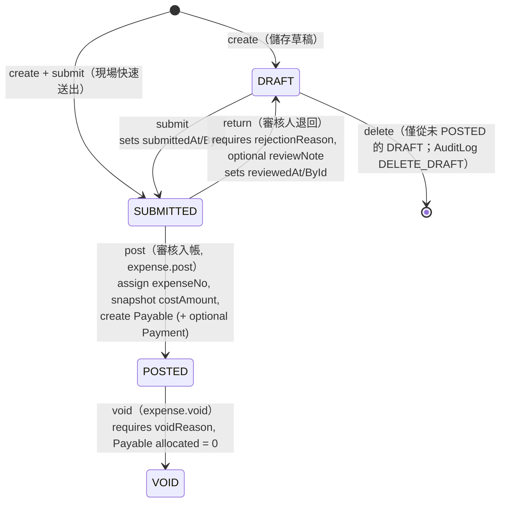
```mermaid
stateDiagram-v2
  [*] --> DRAFT : create（儲存草稿）
  [*] --> SUBMITTED : create + submit（現場快速送出）
  DRAFT --> SUBMITTED : submit<br/>sets submittedAt/ById
  SUBMITTED --> DRAFT : return（審核人退回）<br/>requires rejectionReason, optional reviewNote<br/>sets reviewedAt/ById
  SUBMITTED --> POSTED : post（審核入帳, expense.post）<br/>assign expenseNo, snapshot costAmount,<br/>create Payable (+ optional Payment)
  POSTED --> VOID : void（expense.void）<br/>requires voidReason, Payable allocated = 0
  DRAFT --> [*] : delete（僅從未 POSTED 的 DRAFT；AuditLog DELETE_DRAFT）
```

- 有 `expense.post` 權限者可呼叫 `submit-and-post`：同一 transaction 內依序執行 submit → post（兩個時間戳都寫入），**狀態路徑仍經過 SUBMITTED**。
- 被退回的 DRAFT 保留 `rejectionReason` / `reviewNote` 歷史；再次送出時舊理由寫入 AuditLog，欄位清空。
- DRAFT / SUBMITTED 可編輯（SUBMITTED 僅審核人可改，並記 AuditLog）；POSTED 不可編輯，只能 VOID 後重建。

### 7.2 Payable

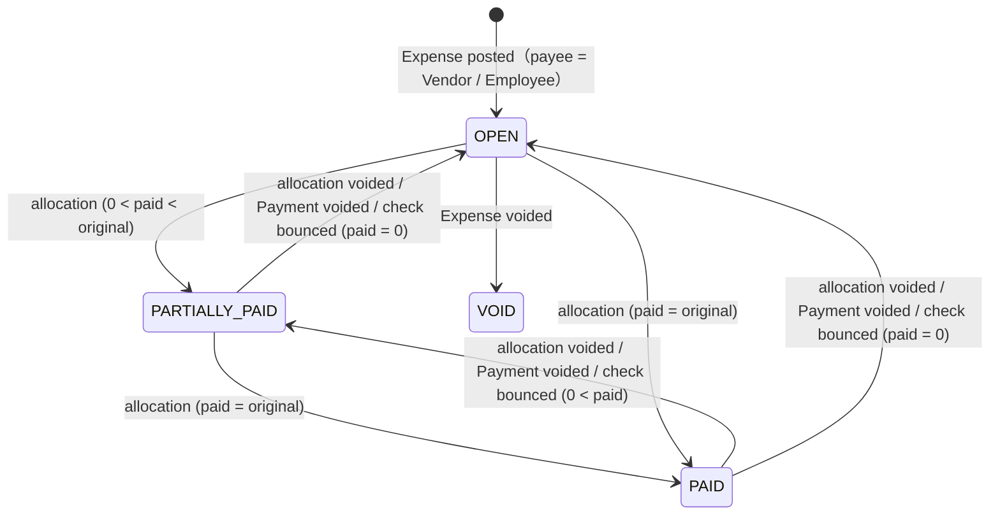
```mermaid
stateDiagram-v2
  [*] --> OPEN : Expense posted（payee = Vendor / Employee）
  OPEN --> PARTIALLY_PAID : allocation (0 < paid < original)
  PARTIALLY_PAID --> PAID : allocation (paid = original)
  OPEN --> PAID : allocation (paid = original)
  PARTIALLY_PAID --> OPEN : allocation voided / Payment voided / check bounced (paid = 0)
  PAID --> PARTIALLY_PAID : allocation voided / Payment voided / check bounced (0 < paid)
  PAID --> OPEN : allocation voided / Payment voided / check bounced (paid = 0)
  OPEN --> VOID : Expense voided
```

> paid 一律由「有效 allocation（voidedAt IS NULL）」重新加總得出，狀態由 paid 推導，不做增量運算。

### 7.3 Payment / Receipt（Settlement）(v0.3)

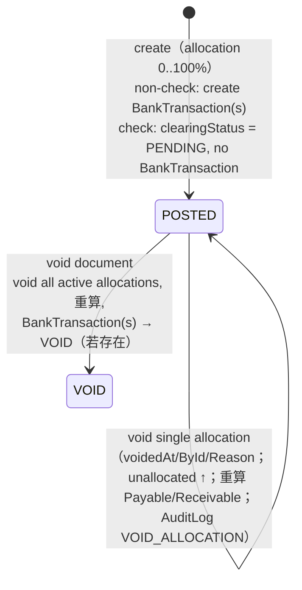
```mermaid
stateDiagram-v2
  [*] --> POSTED : create（allocation 0..100%）<br/>non-check: create BankTransaction(s)<br/>check: clearingStatus = PENDING, no BankTransaction
  POSTED --> POSTED : add allocation（unallocated ↓）
  POSTED --> POSTED : void single allocation（voidedAt/ById/Reason；unallocated ↑；重算 Payable/Receivable；AuditLog VOID_ALLOCATION）
  POSTED --> VOID : void document<br/>void all active allocations, 重算,<br/>BankTransaction(s) → VOID（若存在）
```

### 7.3.1 Allocation (v0.3)

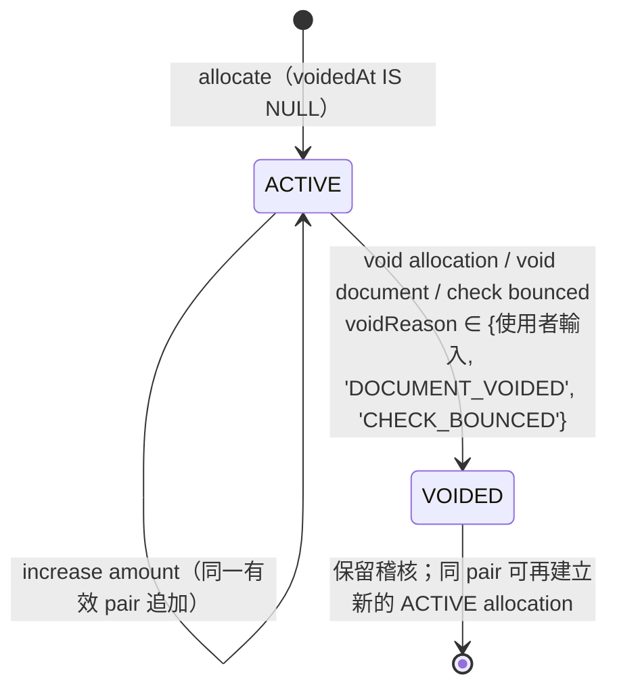
```mermaid
stateDiagram-v2
  [*] --> ACTIVE : allocate（voidedAt IS NULL）
  ACTIVE --> ACTIVE : increase amount（同一有效 pair 追加）
  ACTIVE --> VOIDED : void allocation / void document / check bounced<br/>voidReason ∈ {使用者輸入, 'DOCUMENT_VOIDED', 'CHECK_BOUNCED'}
  VOIDED --> [*] : 保留稽核；同 pair 可再建立新的 ACTIVE allocation
```

### 7.3.2 Check Clearing (v0.3)

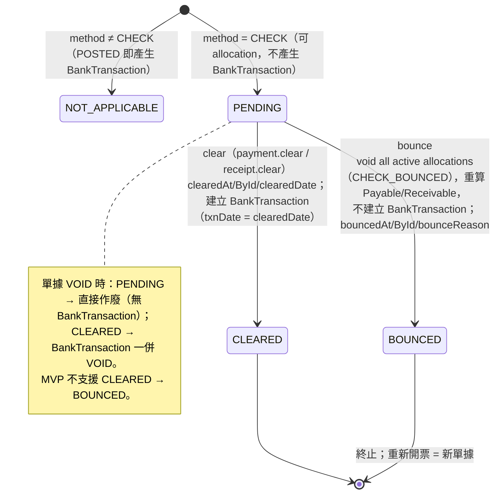
```mermaid
stateDiagram-v2
  [*] --> NOT_APPLICABLE : method ≠ CHECK（POSTED 即產生 BankTransaction）
  [*] --> PENDING : method = CHECK（可 allocation，不產生 BankTransaction）
  PENDING --> CLEARED : clear（payment.clear / receipt.clear）<br/>clearedAt/ById/clearedDate；建立 BankTransaction（txnDate = clearedDate）
  PENDING --> BOUNCED : bounce<br/>void all active allocations（CHECK_BOUNCED），重算 Payable/Receivable，<br/>不建立 BankTransaction；bouncedAt/ById/bounceReason
  CLEARED --> [*]
  BOUNCED --> [*] : 終止；重新開票 = 新單據
  note right of PENDING : 單據 VOID 時：PENDING → 直接作廢（無 BankTransaction）；<br/>CLEARED → BankTransaction 一併 VOID。<br/>MVP 不支援 CLEARED → BOUNCED。
```

### 7.4 Receivable

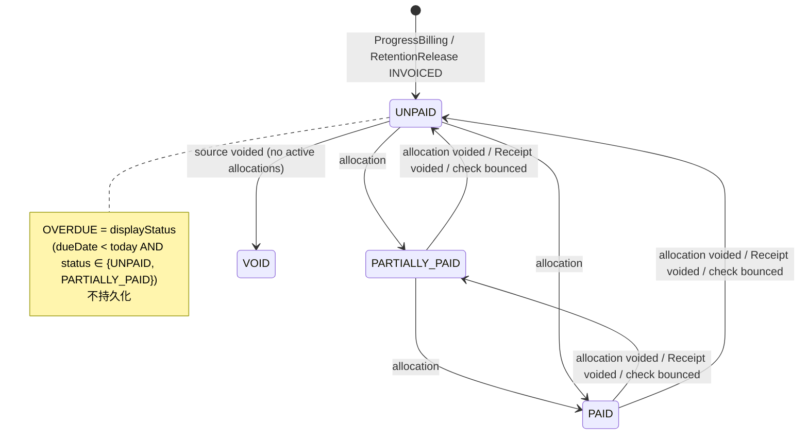
```mermaid
stateDiagram-v2
  [*] --> UNPAID : ProgressBilling / RetentionRelease INVOICED
  UNPAID --> PARTIALLY_PAID : allocation
  PARTIALLY_PAID --> PAID : allocation
  UNPAID --> PAID : allocation
  PARTIALLY_PAID --> UNPAID : allocation voided / Receipt voided / check bounced
  PAID --> PARTIALLY_PAID : allocation voided / Receipt voided / check bounced
  PAID --> UNPAID : allocation voided / Receipt voided / check bounced
  UNPAID --> VOID : source voided (no active allocations)
  note right of UNPAID : OVERDUE = displayStatus<br/>(dueDate < today AND status ∈ {UNPAID, PARTIALLY_PAID})<br/>不持久化
```

### 7.5 ProgressBilling 🆕

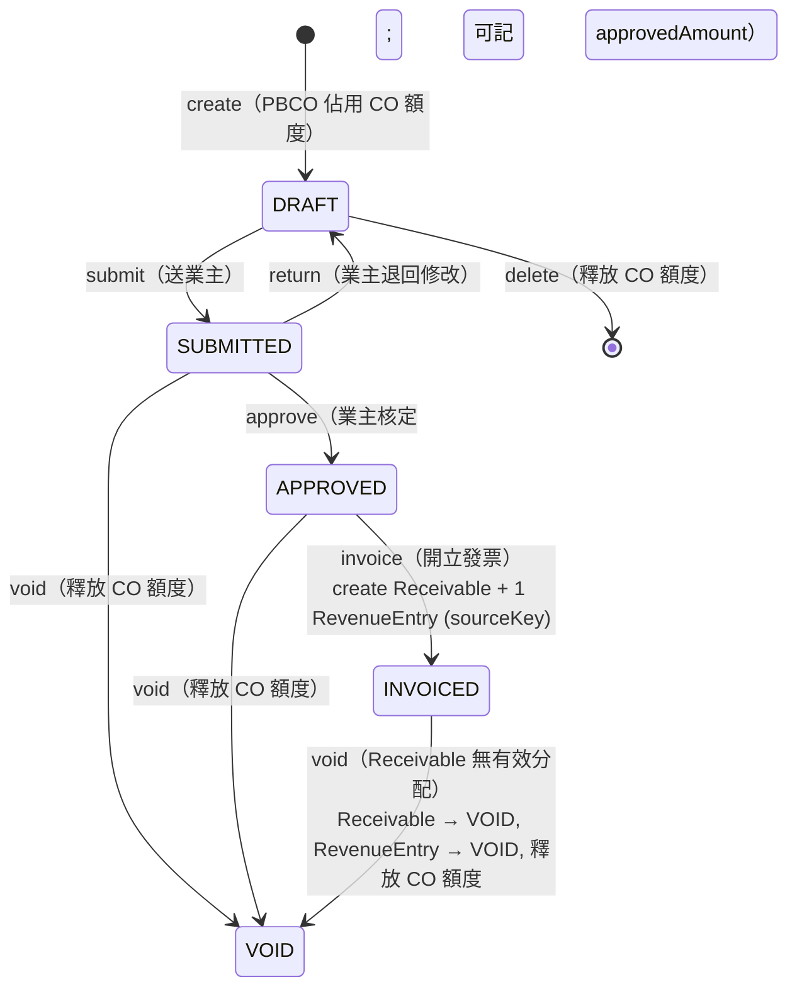
```mermaid
stateDiagram-v2
  [*] --> DRAFT : create（PBCO 佔用 CO 額度）
  DRAFT --> SUBMITTED : submit（送業主）
  SUBMITTED --> DRAFT : return（業主退回修改）
  SUBMITTED --> APPROVED : approve（業主核定; 可記 approvedAmount）
  APPROVED --> INVOICED : invoice（開立發票）<br/>create Receivable + 1 RevenueEntry (sourceKey)
  DRAFT --> [*] : delete（釋放 CO 額度）
  SUBMITTED --> VOID : void（釋放 CO 額度）
  APPROVED --> VOID : void（釋放 CO 額度）
  INVOICED --> VOID : void（Receivable 無有效分配）<br/>Receivable → VOID, RevenueEntry → VOID, 釋放 CO 額度
```

### 7.6 ChangeOrder

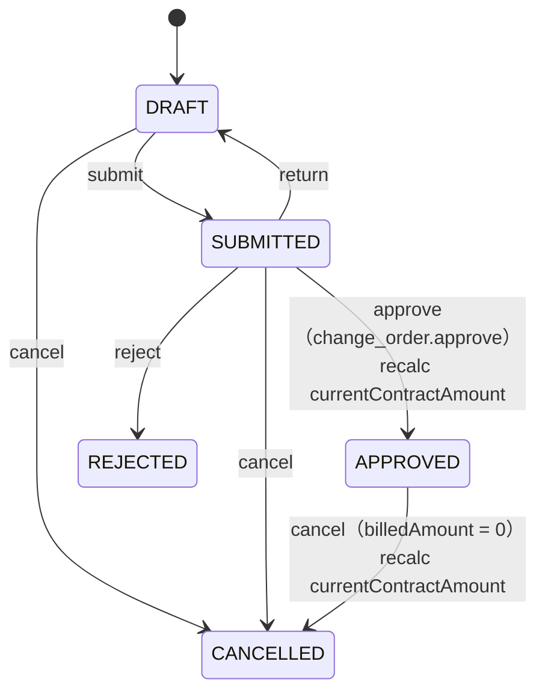
```mermaid
stateDiagram-v2
  [*] --> DRAFT
  DRAFT --> SUBMITTED : submit
  SUBMITTED --> APPROVED : approve（change_order.approve）<br/>recalc currentContractAmount
  SUBMITTED --> REJECTED : reject
  SUBMITTED --> DRAFT : return
  DRAFT --> CANCELLED : cancel
  SUBMITTED --> CANCELLED : cancel
  APPROVED --> CANCELLED : cancel（billedAmount = 0）<br/>recalc currentContractAmount
```

### 7.7 RetentionRelease / RevenueEntry 🆕

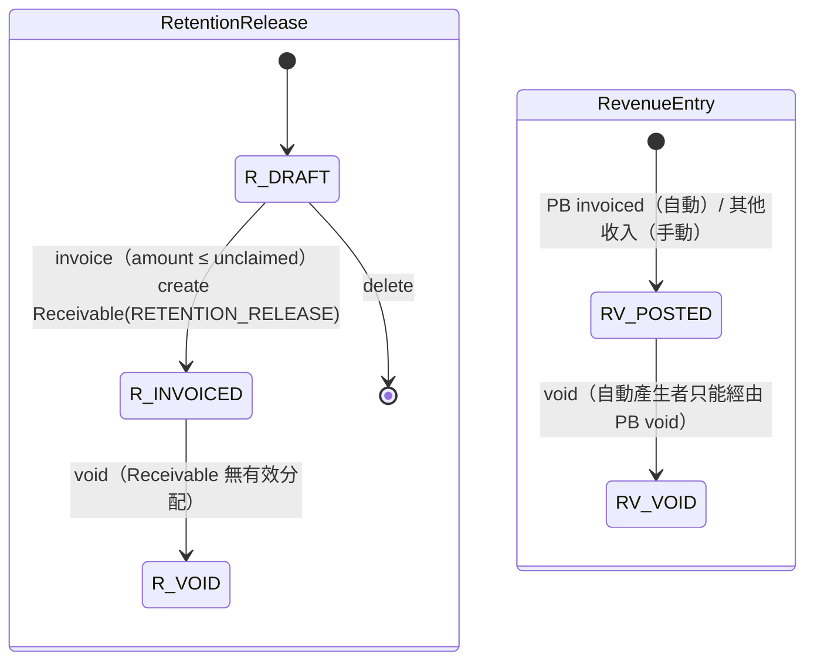
```mermaid
stateDiagram-v2
  state RetentionRelease {
    [*] --> R_DRAFT
    R_DRAFT --> R_INVOICED : invoice（amount ≤ unclaimed）<br/>create Receivable(RETENTION_RELEASE)
    R_INVOICED --> R_VOID : void（Receivable 無有效分配）
    R_DRAFT --> [*] : delete
  }
  state RevenueEntry {
    [*] --> RV_POSTED : PB invoiced（自動）/ 其他收入（手動）
    RV_POSTED --> RV_VOID : void（自動產生者只能經由 PB void）
  }
```

---

## 8. API Modules

### 8.1 慣例

- Base path `/api/v1`；resource 路徑不含 organizationId。
- 狀態變更用 command endpoint（`POST /expenses/:id/submit`）。
- List：`?cursor=&limit=&sort=&filter[...]` → `{ data, nextCursor }`。
- 帳務寫入需帶 `version`；create 需帶 `clientRequestId`。
- **所有 mutation 需 `X-CSRF-Token` header + 合法 Origin**；`Content-Type: application/json`。
- 敏感欄位只回傳 masked；完整值只能由 reveal endpoint 取得。

### 8.2 Endpoint 清單（MVP；🆕 = v0.2 新增/修改）

| Module | Endpoints | Permission |
|--------|-----------|------------|
| **auth** | 🆕 `GET /auth/csrf` · `POST /auth/login` · `POST /auth/refresh` · `POST /auth/logout` · `GET /auth/me` · ~~`POST /auth/switch-organization`~~（🆕 MVP 不開放，保留設計） | public / authenticated |
| **iam** | `GET/POST /users` · `GET/PATCH /users/:id` · `POST /users/:id/deactivate` · `GET /roles` · `PUT /roles/:id/permissions` · `GET /permissions` | `user.manage`, `role.manage` |
| **organization** | `GET/PATCH /organization` | `settings.manage` |
| **audit** | `GET /audit-logs?entityType=&entityId=` | `audit.read` |
| **attachment** | `POST /attachments/presign` · `POST /attachments/:id/complete` · `GET /attachments/:id/url` · `POST /attachments/:id/links` | 依連結對象 |
| **customer** | `GET/POST /customers` · `GET/PATCH /customers/:id` · `POST /customers/:id/archive` | `customer.*` |
| **vendor** | `GET/POST /vendors` · `GET/PATCH /vendors/:id` · `POST /vendors/:id/archive` · 🆕 `PUT /vendors/:id/bank-account` · 🆕 `POST /vendors/:id/bank-account/reveal` | `vendor.*`；🆕 `vendor.bank.write`, `vendor.bank.reveal` |
| **cost-category** | `GET/POST /cost-categories?scope=` · `PATCH /cost-categories/:id` | `settings.manage` |
| **bank-account** | `GET/POST /bank-accounts` · `PATCH /bank-accounts/:id` · 🆕 `POST /bank-accounts/:id/reveal` | `bank.manage` |
| **project** | `GET/POST /projects` · `GET/PATCH /projects/:id` · `POST /projects/:id/status` · 🆕 `PUT /projects/:id/physical-progress` · `GET/PUT /projects/:id/members` | `project.*` + scope |
| **contract** | `GET/POST /projects/:id/contracts`（🆕 MVP 第二份 OWNER_CONTRACT → 409） · `PATCH /contracts/:id` | `contract.write` |
| **change-order** | `GET/POST /projects/:id/change-orders` · `PATCH /change-orders/:id` · `POST /change-orders/:id/{submit,return,approve,reject,cancel}` · 🆕 `GET /projects/:id/change-orders/billable`（剩餘可請款額度） | `change_order.write/approve` |
| **budget** | `GET /projects/:id/budgets` · `PUT /projects/:id/budgets` | `budget.write` |
| **daily-log** | `GET/POST /projects/:id/daily-logs` · `GET/PATCH /daily-logs/:id` | `daily_log.write` |
| **expense** 🆕 | `GET /expenses?scope=&status=&projectId=` · `POST /expenses`（body `submit: boolean`；scope 必填；v0.3 `advancedByEmployeeId?`；item 不接受 projectId） · `POST /expenses/quick`（建立並 SUBMITTED） · `GET /expenses/:id` · `PATCH /expenses/:id`（DRAFT；SUBMITTED 限審核人） · `DELETE /expenses/:id`（僅 DRAFT） · `POST /expenses/:id/submit` · `POST /expenses/:id/return`（`rejectionReason`, `reviewNote?`） · `POST /expenses/:id/post`（可附 `settlement` 立即付款） · `POST /expenses/:id/submit-and-post` · `POST /expenses/:id/void` · `GET /expenses/review-queue` | `expense.create`, `expense.submit`, 🆕 `expense.review`, `expense.post`, `expense.void`, 🆕 `expense.overhead` |
| **payable** | `GET /payables?vendorId=&projectId=&scope=&status=&dueBefore=` · `GET /payables/:id` | `payable.read` |
| **employee** (v0.3) | `GET/POST /employees` · `GET/PATCH /employees/:id` · `POST /employees/:id/deactivate` · `PUT /employees/:id/bank-account` · `POST /employees/:id/bank-account/reveal` | `employee.read`, `employee.write`；銀行帳號 `employee.bank.reveal` |
| **payment** (v0.3) | `GET/POST /payments`（body：`payeeType`, `vendorId?`, `employeeId?`, `feeBearer?`, `method`, `allocations?`） · `GET /payments/:id` · `POST /payments/:paymentId/allocations` · **`POST /payments/:paymentId/allocations/:allocationId/void`**（`voidReason` 必填） · `POST /payments/:id/void` · **`POST /payments/:id/clear`**（`clearedDate`） · **`POST /payments/:id/bounce`**（`bounceReason`） · `GET /vendors/:id/unallocated-payments` · `GET /employees/:id/unallocated-payments` | `payment.create/allocate/void`, **`payment.clear`** |
| **progress-billing** 🆕 | `GET/POST /projects/:id/progress-billings`（body 含 `changeOrders: [{changeOrderId, amount}]`） · `POST /progress-billings/preview` · `GET/PATCH /progress-billings/:id` · `PUT /progress-billings/:id/change-orders` · `POST /progress-billings/:id/{submit,return,approve,invoice,void}` · `DELETE /progress-billings/:id`（僅 DRAFT） | `billing.create/approve/invoice/void` |
| **receivable** | `GET /receivables?…&overdue=true` · `GET /receivables/:id`（回傳 `displayStatus`） | `receivable.read` |
| **receipt** (v0.3) | `GET/POST /receipts`（allocations 可空；`projectId?`；`feeBearer` 僅接受 COMPANY） · `GET /receipts/:id` · `POST /receipts/:receiptId/allocations` · **`POST /receipts/:receiptId/allocations/:allocationId/void`** · `POST /receipts/:id/void` · **`POST /receipts/:id/clear`** · **`POST /receipts/:id/bounce`** · `GET /customers/:id/unallocated-receipts` | `receipt.create/allocate/void`, **`receipt.clear`** |
| **retention** 🆕 | `GET /projects/:id/retention` · `POST /projects/:id/retention-releases` · `POST /retention-releases/:id/invoice` · `POST /retention-releases/:id/void` | `billing.*` |
| **revenue** 🆕 | `GET /revenue-entries?sourceType=` · `POST /revenue-entries`（僅 OTHER_INCOME / MANUAL_ADJUSTMENT） · `POST /revenue-entries/:id/void`（PROGRESS_BILLING 來源 → 422） | `revenue.write` |
| **bank-transaction** | `GET /bank-accounts/:id/transactions` · `POST /bank-transactions`（MANUAL） · `POST /bank-transactions/:id/void`（僅 MANUAL） | `bank.manage` |
| **petty-cash** | `GET/POST /petty-cash/transactions` · `GET /petty-cash/balance` | `petty_cash.manage` |
| **project-financials** 🆕 | `GET /projects/:id/financials`（回傳欄位改為 `estimatedProjectProfit`, `recognizedProfit`… 見 §3.4） · `GET /projects/:id/budget-vs-actual` | `report.project.read` + scope |
| **company-dashboard** 🆕 | `GET /dashboard/summary`（含待審支出數；scoped user 僅計算可見工程） | `dashboard.read` |
| **reports** 🆕 | `GET /reports/{ar-aging, ap-aging, retention, project-profitability, cost-by-category, overhead, unallocated-settlements, employee-advances}`；未來：`pending-checks`（待兌現應付/應收票據）、`cash-flow` | `report.financial.read`；overhead 需 🆕 `report.overhead.read` |

### 8.3 Permission × Role 預設矩陣

| Permission 群組 | OWNER | ADMIN | ACCOUNTANT | PROJECT_MANAGER | SITE_MANAGER | PURCHASER | VIEWER |
|-----------------|:-----:|:-----:|:----------:|:---------------:|:------------:|:---------:|:------:|
| settings / user / role manage | ✔ | ✔ | – | – | – | – | – |
| customer / vendor write | ✔ | ✔ | ✔ | ✔ | – | ✔(vendor) | – |
| vendor.bank.write / reveal | ✔ | ✔ | ✔ | – | – | – | – |
| employee.read (v0.3) | ✔ | ✔ | ✔ | ✔ | ✔ | ✔ | – |
| employee.write (v0.3) | ✔ | ✔ | ✔ | – | – | – | – |
| employee.bank.reveal (v0.3) | ✔ | ✔ | ✔ | – | – | – | – |
| project write | ✔ | ✔ | – | ✔ (scope) | – | – | – |
| contract / change order write | ✔ | ✔ | ✔ | ✔ (scope) | – | – | – |
| change order approve | ✔ | ✔ | – | – | – | – | – |
| budget write | ✔ | ✔ | ✔ | ✔ (scope) | – | – | – |
| expense.create / submit（PROJECT） | ✔ | ✔ | ✔ | ✔ (scope) | ✔ (scope) | ✔ | – |
| expense.overhead（建立管銷支出） | ✔ | ✔ | ✔ | – | – | – | – |
| expense.review / post | ✔ | ✔ | ✔ | – | – | – | – |
| expense.void | ✔ | ✔ | ✔ | – | – | – | – |
| payment / receipt create / allocate / void（含單筆 allocation void） | ✔ | ✔ | ✔ | – | – | – | – |
| payment.clear / receipt.clear（兌現、退票） (v0.3) | ✔ | ✔ | ✔ | – | – | – | – |
| billing create | ✔ | ✔ | ✔ | ✔ (scope) | – | – | – |
| billing approve / invoice / void | ✔ | ✔ | ✔ | – | – | – | – |
| revenue.write（其他收入） | ✔ | ✔ | ✔ | – | – | – | – |
| daily log write | ✔ | ✔ | – | ✔ (scope) | ✔ (scope) | – | – |
| report.financial.read | ✔ | ✔ | ✔ | ✔ (scope) | – | – | ✔ |
| report.overhead.read | ✔ | ✔ | ✔ | – | – | – | – |
| audit.read | ✔ | ✔ | ✔ | – | – | – | – |

---

## 9. Mobile / Desktop Route Map

### 9.1 Navigation

**Mobile Bottom Navigation（< 768px）**

```
┌──────────────────────────────────────────────┐
│  首頁      工程     [ ＋ 新增 ]    帳務     我的  │  ← 64px + safe-area
│   /     /projects   (Sheet)    /finance   /me   │     中間 CTA 56px
└──────────────────────────────────────────────┘
```

「＋新增」Bottom Sheet（每項 56px；🆕 v0.2 命名調整）：

| 選項 | 說明文字（副標） | 目標 Route |
|------|-----------------|-----------|
| 新增支出 | 買材料、工資、雜支 | `/expenses/new` |
| 拍攝發票/收據 | 拍照後填金額 | `/expenses/new?capture=1` |
| 🆕 **新增收款** | 業主匯款、工程款入帳 | `/finance/receipts/new` |
| 新增請款 | 估驗請款單 | `/billings/new` |
| 新增付款 | 付廠商、月結 | `/finance/payments/new` |
| 🆕 **其他收入 / 收入認列** | 非工程款收入、收入調整（會計用） | `/finance/revenue/new` |
| 新增工程日誌 | | `/projects/daily-log/new` |
| 新增工程照片 | | `/projects/photos/new?capture=1` |

> 選項依權限顯示（例如工地主任只看到支出、拍照、日誌、照片）。「其他收入 / 收入認列」排在「新增收款」之後，並以副標說明差異。

**Desktop Left Sidebar**：依規格 §五；🆕「帳務 › 收入」改名為「**收入認列**」，「收款」保持獨立；🆕 帳務下新增「**支出審核**」。

### 9.2 Route Map

| Route | 頁面 | Mobile | Desktop | Sidebar |
|-------|------|--------|---------|---------|
| `/login` | 登入 | 全螢幕 | 置中卡片 | — |
| `/` | Dashboard | KPI 卡 + 待處理（含 🆕 待審支出 / 被退回支出） | KPI + 圖表 + 待辦 | Dashboard |
| `/projects` | 工程列表 | Card（名稱、實體進度、合約、已收、成本、**預估毛利 %**） | Table | 工程管理 › 工程 |
| `/projects/new` | 新增工程 | 單欄 | 兩欄 | |
| `/projects/[id]` | 工程總覽 | 摘要卡：🆕「預估工程毛利」「已認列損益」分區；chips 分頁 | 左摘要右明細 | |
| `/projects/[id]/budget` | 預算 vs 實際 | Category Card | Table | 工程管理 › 工程預算 |
| `/projects/[id]/costs` | 工程成本（POSTED） + 待審（SUBMITTED，分開顯示） | Card | Table | 工程管理 › 工程成本 |
| `/projects/[id]/change-orders` | 追加減（含已請款/剩餘額度） | Card | Table | 工程管理 › 追加減工程 |
| `/projects/[id]/billings` | 本工程估驗請款 | Card | Table | |
| `/projects/[id]/retention` | 保留款（累計 / 已請領 / 未請領 / 預計退還日） | 摘要卡 | 摘要 + 明細 | |
| `/projects/[id]/daily-logs` | 工程日誌 | Timeline | Timeline | |
| `/projects/[id]/photos` | 工程照片 | 3 欄 grid | 6 欄 grid | |
| `/projects/[id]/settings` | 合約、成員、基本資料、實體進度 | | | |
| `/budgets` · `/costs` · `/change-orders` | 跨工程總覽 | 先選工程 | 跨工程 Table | 工程管理 |
| `/expenses/new` | 快速新增支出 | 單頁表單（§9.3） | Sheet | |
| `/expenses/[id]` | 支出明細（含狀態與審核紀錄） | | | |
| 🆕 `/expenses/review` | 支出審核佇列 | Card + 入帳 / 退回 大按鈕 | Table + 批次入帳 | 帳務 › 支出審核 |
| `/finance` | 帳務 Hub（Mobile） | 大按鈕清單 | redirect | |
| 🆕 `/finance/revenue` (`/new`) | 收入認列 / 其他收入 | Card | Table | 帳務 › 收入認列 |
| `/finance/expenses` | 支出（🆕 scope 篩選：工程 / 管銷） | Card | Table | 帳務 › 支出 |
| `/finance/receivables` | 應收帳款 | Card（逾期紅標） | Table + 帳齡 | 帳務 › 應收帳款 |
| `/finance/payables` | 應付帳款 | Card | Table + 批次付款 | 帳務 › 應付帳款 |
| `/finance/receipts` (`/new`) | 收款（🆕 可不分配 / 部分分配） | 步驟式 | 單頁 + 應收勾選 | 帳務 › 收款 |
| `/finance/payments` (`/new`) | 付款（🆕 可不分配 / 部分分配） | 步驟式 | 單頁 + 應付勾選 | 帳務 › 付款 |
| `/finance/petty-cash` | 零用金 | 餘額卡 + Card | Table | 帳務 › 零用金 |
| `/billings` (`/new`, `/[id]`) | 估驗請款（🆕 追加減以「選擇已核准 CO + 本期金額」輸入） | 步驟式 | 表單 + 公式預覽 | 估驗請款 |
| `/vendors` (`/new`, `/[id]`) | 廠商（🆕 銀行帳號 masked + 顯示按鈕） | Card | Table | 廠商 |
| `/customers` | 業主 | Card | Table | 業主 |
| `/reports/*` | 報表（🆕 管銷、未分配收付款） | 清單 → 摘要卡 | 報表 | 報表 |
| `/documents` | 文件 | Grid | Table | 文件 |
| `/settings/*` | organization / users / roles / **employees (v0.3)** / cost-categories / bank-accounts | 清單 | 分頁 | 系統設定 |
| `/finance/checks` (未來) | 待兌現應付 / 應收票據；兌現、退票操作 | Card | Table | 帳務 › 票據 |
| `/me` | 我的（個人資料、🆕 本機草稿、登出） | 清單 | — | |

### 9.3 快速新增支出（Phase 5，含 IndexedDB 草稿）

```
┌─────────────────────────────┐
│ ←  新增支出        草稿已儲存 ✓│ ← autosave 指示（IndexedDB）
├─────────────────────────────┤
│ 類型   [工程 ◉][管銷 ○]        │ ← 🆕 僅有 expense.overhead 權限者看到；預設工程
│ 工程   [ XX大樓工程        ▾ ] │
│ 金額   [ $            0    ] │ ← inputMode=numeric，24px
│        含稅 ◉  未稅 ○          │
│ 分類   [材料][工資][分包][雜支]│ ← 依 scope 過濾 CostCategory
│ 供應商 [ 搜尋或新增…       ▾ ] │ ← 送審可空（會計入帳時必填）；快速新增廠商只需名稱
│ 付款   [未付][部分][已付][我代墊]│ ← declaredPaymentStatus；「我代墊」帶入 advancedByEmployeeId（目前使用者對應的 Employee，可改選）
│ 📷 拍攝發票/收據  (+2 張)     │
│ 備註   [                    ] │
│ ▸ 更多資料（日期、憑證類型、發票號碼、可扣抵、付款方式、明細拆分、到期日）│
├─────────────────────────────┤
│ [  存草稿  ] [   送出審核（56px）   ] │
└─────────────────────────────┘
```

**Phase 5 Offline Draft 行為（Dexie）**：

| 項目 | 規格 |
|------|------|
| Dexie DB | `ceproject-{userId}`；table `expenseDrafts`：`localId`, `clientRequestId`, `organizationId`, `formData`, `photoRefs[]`, `syncState: 'editing' \| 'submitting' \| 'failed' \| 'synced'`, `lastError?`, `updatedAt`；table `photoBlobs`：`id`, `blob`, `mimeType`, `uploadState`, `attachmentId?` |
| Schema 版本 | Dexie `version(n).upgrade()` 版本化；Phase 9 只新增 table（`dailyLogDrafts`, `syncQueue`），不重寫 |
| Autosave | 表單變更 debounce 500ms 寫入；重開頁面自動提示「繼續上次草稿」 |
| 送出 | 先上傳照片 → 送 API（帶 `clientRequestId`）→ 成功標記 `synced` 並刪除草稿；**失敗時保持 `failed`，表單與照片不清除**，顯示「重試」 |
| 重複送出 | 同一 `clientRequestId` 重送回傳既有 Expense（ADR-12） |
| 本機草稿 vs Server DRAFT | 本機草稿 = 尚未送到 server 的裝置資料；Server `DRAFT` = 已存到 server 但未送審。UI 上分別標示「本機草稿」與「草稿」 |
| 安全 | 登出時若有未同步草稿 → 警告；確認後清除該使用者 Dexie DB；不在 IndexedDB 存 token |
| Phase 9 補充 | Service Worker、背景 sync queue、auto retry（exponential backoff）、DailyLog offline、Photo offline queue、上線通知 |

### 9.4 UI Design Tokens

| 項目 | 規範 |
|------|------|
| Touch target | 一般 48px；CTA 56px；icon button ≥ 44×44 |
| 字級 | 內文 16px；金額 KPI 24–28px tabular-nums |
| 表單 | Mobile 單欄；label 在上 |
| 列表 | `<ResponsiveList>`：md 以下 Card、以上 Table；禁止 horizontal scroll |
| 互動 | 無 hover-only；row actions 用 `⋯` + Sheet |
| 狀態標示 | 文字 + 顏色（草稿 / 待審 / 已入帳 / 已作廢 / 未付 / 部分 / 已付 / 逾期） |
| 數字鍵盤 | TWD 預設 `inputMode="numeric"`；電話 `type="tel"` |
| 敏感值 | `<MaskedValue>`：預設遮罩，點「顯示」→ 呼叫 reveal API（需權限），30 秒後自動遮回 |
| 損益區塊 | 「預估工程毛利」與「已認列損益」使用不同卡片與說明 tooltip（tap 開啟，非 hover） |

---

## 10. 潛在技術債與規格風險

| # | 問題 | 狀態 | 處理 |
|---|------|------|------|
| TD-01 | Expense.paymentStatus vs Payable.status 重複 | 已處理 | derived cache；DRAFT/SUBMITTED 只有 declaredPaymentStatus |
| TD-02 | 單筆付款無法沖多張應付 | 已處理 | Header + allocation |
| TD-03 | Project 合約金額與 Contract / CO 重複 | 已處理 | cache + recalc + reconciliation |
| TD-04 | 業務日期存 UTC timestamp | 已處理 | DATE |
| TD-05 | Attachment 多型關聯無 FK | 接受 | AttachmentLink + service 驗證 + orphan 清理 |
| TD-06 | Attachment url 過期 | 已處理 | signed URL on read |
| TD-07 | 收入認列政策 | 🆕 已決策 | INVOICED 時認列未稅 |
| TD-08 | 稅額處理 | 🆕 已決策 | costAmount 規則（§3.4） |
| TD-09 | 管銷費用 | 🆕 已決策 | ExpenseScope OVERHEAD + CHECK |
| TD-10 | RBAC 無 project scope | 已處理 | ProjectMember；🆕 Reporting 同樣強制 |
| TD-11 | 文件編號併發 | 已處理 | DocumentSequence；🆕 Expense 於 POSTED 才配號（草稿刪除不產生跳號） |
| TD-12 | OVERDUE 為時間依賴 | 已處理 | displayStatus |
| TD-13 | Estimated Final Cost 定義 | MVP 公式 | 未來 ProjectCostForecast（ETC） |
| TD-14 | 進度來源 | 🆕 已決策 | physical vs billed 分開 |
| TD-15 | 作廢反轉 | 已處理 | 同 transaction 重算 + BankTransaction VOID |
| TD-16 | 關帳 | 預留 | `Organization.lockedUntilDate` |
| TD-17 | 廠商折讓 / 負數支出 | 未處理 | MVP 作廢重開；未來 ExpenseAdjustment（additive） |
| TD-18 | 分包估驗、應付保留款 | 🆕 決策：MVP 不做 | 預留 `ContractType.SUBCONTRACT`、`PayableSource` 可擴充 SUBCONTRACT_BILLING / RETENTION |
| TD-19 | 工班扣繳 / 二代健保 | 預留 | `Payment.withholdingAmount`（預設 0） |
| TD-20 | Offline 重送 | 🆕 提前 | Phase 5 Dexie + clientRequestId |
| TD-21 | AuditLog 敏感資料 / 體積 | v0.3 定案 | diff format v1 + Redactor（§3.9）；按月 partition（未來） |
| TD-22 | 雙式會計 | 預留 | 完整 source document + event |
| TD-23 | Enum 不同步 | 處理 | shared enums + metric-status 全覆蓋測試 |
| TD-24 | 多組織使用者 | 🆕 已決策 | Schema 支援，UI 不開放 |
| TD-25 | Retention rate 中途變更 | 已處理 | 每期存實值 |
| TD-26 | 累計估驗 / 詳細工項 | 🆕 預留 | ProgressBillingItem + ContractItem 方向（§3.6） |
| TD-27 | 雙服務部署 | 🆕 已決策 | Docker portable |
| TD-28 | 付款手續費由廠商負擔（內扣） | v0.3 已處理 | `FeeBearer`（ADR-27） |
| TD-29 | 現場人員自行代墊 | v0.3 已處理 | Employee + PayeeType（ADR-26） |
| TD-30 | 取消單筆分配 | v0.3 已處理 | Allocation voidable + partial unique（ADR-25） |
| TD-31 | 預收工程款開立發票時點 | 延後（ADR-33） | MVP 不認列；CustomerAdvance 階段一併設計 |
| TD-33 | 支票兌現前即計入銀行餘額 | v0.3 已處理 | ClearingStatus（ADR-28） |
| TD-34 | 支票 CLEARED 後被銀行退回 | 接受 | MVP 以作廢 + 手動 BankTransaction 處理；未來 CLEARED → BOUNCED transition |
| TD-35 | 單一 payee 規則僅 application 層保證 | 接受 | 建立 allocation 時鎖 Payment 列比對 + reconciliation；如需 DB 保證，可於 PayablePayment 冗餘 payee 欄位 + composite FK（additive） |
| TD-36 | Expense 跨工程分攤 | 延後（ADR-31） | 未來 CostAllocation |
| TD-37 | 多層審核 / 金額門檻 | 延後（ADR-32） | 未來 ApprovalPolicy / ApprovalStep |
| 🆕 TD-32 | 手續費歸類 OVERHEAD 財務費用，但不是 Expense 記錄 | 接受 | 報表由 Payment/Receipt.feeAmount 彙總；未來雙式會計時轉傳票 |

---

## 11. MVP 開發順序

每個 Phase gate：`pnpm turbo lint typecheck test` 全綠 + 驗收清單。

| Phase | 內容 | 驗收 |
|-------|------|------|
| **1. 專案架構** | Monorepo（pnpm workspaces + Turborepo）、strict tsconfig、ESLint（boundaries、禁 `$queryRawUnsafe`、`$queryRaw` 限制路徑）、Prettier、Vitest、docker-compose（PostgreSQL、MinIO、Mailpit）、Dockerfiles、CI、Next.js shell（RWD AppShell、Mobile Bottom Navigation、Desktop Sidebar、Quick Add Sheet shell）、NestJS skeleton（health endpoint、ExceptionFilter、requestId、pino redact）、`packages/shared`：money、date、state machine definitions、metric status definitions | 見 §11.1 |
| **2. Prisma Schema** | **Gate 0：Manual Constraint PoC**（§11.2）→ 通過後：§6 全部 models、enums、§6.4 integrity、§6.5 composite FK、seed | Gate 0 報告；每條 I-xx 約束的違反測試；constraints registry 測試 |
| **3. Auth / User / RBAC** | Login/refresh/logout、**CSRF（Origin + double-submit）**、cookie 屬性、Membership、PermissionGuard、ProjectAccessService、ReferenceGuard、AuditService + Redactor、CryptoService | 權限矩陣測試；CSRF 測試（缺 header / 錯 Origin / form content-type → 403）；跨 org reference → 404 |
| **4. Project / Customer / Vendor** | + **Employee master**、CostCategory（scope）、Contract（一工程一份）、ChangeOrder、ProjectBudget、numbering、Attachment、Vendor 銀行帳號加密 / reveal | CO 核准後 currentContract 正確；銀行帳號不出現在 log / audit / response |
| **5. Expense / Payable / Payment** | **Quick Expense + Dexie Offline Draft**、Expense 審核流程、OVERHEAD、員工代墊（payee）、Payable、Payment（含未分配、feeBearer、單筆 allocation void、支票 clear / bounce）、BankTransaction（principal + fee）、作廢反轉、review queue | 100000→30000→20000→剩 50000；取消 30000 那筆 allocation → 剩 80000；POSTED 才計成本；代墊案例 payee=EMPLOYEE；支票 PENDING 不影響銀行餘額、BOUNCED 回復 Payable；飛航模式填表 → 失敗 → 重開仍在 → 恢復後手動重試成功且不重複 |
| **6. Progress Billing / Receivable / Receipt** | 估驗公式、**ProgressBillingChangeOrder + 額度控制**、Receivable、Receipt（含未分配、手續費、單筆 allocation void、支票 clear / bounce）、Retention、RevenueEntry（INVOICED 自動，sourceKey 冪等） | 併發請同一 CO → 只有一筆成功；重複 invoice 不產生第二筆 RevenueEntry；四種收入金額獨立；Treasury 不變式測試 |
| **7. Project Dashboard** | ReportingRepository + ReportingContext、project-financials（§3.4 全部指標） | golden test；tenant-leak test；status whitelist 全覆蓋 |
| **8. Company Dashboard** | dashboard summary、AR/AP aging、retention、overhead、unallocated 報表 | 時區邊界測試；scoped user 只看到自己工程 |
| **9. PWA / Offline** | Service Worker、sync queue、auto retry、DailyLog offline、Photo offline queue、manifest | 背景自動重送；照片離線排隊 |

### 11.1 Phase 1 Acceptance Checklist

**範圍限制**：不建立 business feature、不建立 Prisma Schema、不建立 Expense / Payment / Billing CRUD。

| # | 項目 | 驗收標準 |
|---|------|----------|
| P1-01 | Monorepo | `pnpm install` 成功；`pnpm-workspace.yaml` 含 `apps/*`、`packages/*`；Turborepo pipeline：`lint`、`typecheck`、`test`、`build` |
| P1-02 | TypeScript strict | 共用 `packages/config/tsconfig/base.json`：`strict`、`noUncheckedIndexedAccess`、`exactOptionalPropertyTypes`、`noImplicitOverride` |
| P1-03 | ESLint | flat config；`@typescript-eslint/no-explicit-any: error`；禁止 `$queryRawUnsafe` / `$executeRawUnsafe`；`$queryRaw` 只允許 `modules/reporting/infrastructure/**`；module boundaries 規則（跨 module 只能 import 對方 public entry） |
| P1-04 | Prettier | `pnpm format:check` 通過 |
| P1-05 | Vitest | shared / api / web 皆有測試並通過 |
| P1-06 | `packages/shared` money | `Money` 以 decimal.js 實作；加減乘、比較、TWD 稅額四捨五入、`MoneyString` 格式驗證、format；含 0.1 + 0.2 等 floating point 測試 |
| P1-07 | `packages/shared` date | `BusinessDate`（YYYY-MM-DD）、org timezone 下的 today / 月份範圍、UTC instant ↔ 顯示轉換；含 Asia/Taipei 00:00–08:00 邊界測試 |
| P1-08 | State machine definitions | §7 所有狀態機以純資料定義（Expense、Payable、Settlement、Allocation、CheckClearing、Receivable、ProgressBilling、ChangeOrder、RetentionRelease、RevenueEntry）；`canTransition` / `assertTransition`；測試覆蓋合法與非法 transition |
| P1-09 | Metric status definitions | §3.4 每個 metric 的 status whitelist 常數；測試確保每個 enum 值都被明確分類（included / excluded），不允許遺漏 |
| P1-10 | NestJS skeleton | `GET /api/v1/health` 回 `{ status: "ok", … }`；global ExceptionFilter 輸出 §2.4 統一錯誤格式；`x-request-id`；pino redact 設定；helmet；e2e 測試 |
| P1-11 | Next.js shell | RWD AppShell：< 768px Bottom Navigation（首頁 / 工程 / 新增 / 帳務 / 我的），≥ 1024px Left Sidebar（§9.1 群組），768–1023 icon rail；Quick Add Sheet（§9.1 選項與命名）；按鈕 ≥ 48px、CTA ≥ 56px；safe-area；無 horizontal scroll；placeholder 頁面 |
| P1-12 | Docker | `docker-compose.yml`：PostgreSQL 16、MinIO（+ bucket 初始化）、Mailpit；`apps/api/Dockerfile`、`apps/web/Dockerfile`（multi-stage）；`.env.example` |
| P1-13 | CI | GitHub Actions：install → format:check → lint → typecheck → test → build |
| P1-14 | Gate | `pnpm lint`、`pnpm typecheck`、`pnpm test`、`pnpm build` 全部通過 |

### 11.2 Phase 2 Gate 0：Prisma Manual Constraint PoC（R-13）

在建立完整 Schema 前，以 2–3 張最小 PoC 表（例：`PocOrg`、`PocPayment`、`PocAllocation`）驗證：

| # | 驗證項目 | 通過條件 |
|---|----------|----------|
| G0-1 | CHECK constraint（含依 enum 分支的金額 CHECK） | 存在且違反時 INSERT 失敗 |
| G0-2 | Partial unique index（`WHERE "voidedAt" IS NULL`） | 存在；有效重複失敗、作廢後可重建 |
| G0-3 | Composite FK `(organizationId, xId)`（必填與可空兩種） | 跨 org relation INSERT 失敗；可空時 NULL 可通過 |
| G0-4 | `prisma migrate dev`（新增一個無關欄位的第二個 migration） | 不產生 DROP manual constraint 的 SQL |
| G0-5 | `prisma migrate reset` | 重建後所有 manual constraints 存在 |
| G0-6 | `prisma migrate deploy`（乾淨 DB） | 所有 manual constraints 存在 |
| G0-7 | `prisma migrate diff`（drift 檢查） | 輸出記錄於報告；確認 CI 檢查方式 |
| G0-8 | Prisma relation 宣告 composite FK（optional relation 情境） | 記錄 Prisma 是否原生支援；不支援則確認 Hybrid 策略可行 |

**產出**：`docs/adr/ADR-034-prisma-manual-constraints.md`（結果與最終 migration strategy）。**任何一項失敗 → 停止並提出替代 migration strategy，經 Review 後才建立完整 Schema。**

---

## 12. 產品決策紀錄與待確認事項

### 12.1 v0.2 已採用決策

| # | 決策 |
|---|------|
| D-01 | Revenue recognition MVP：ProgressBilling **INVOICED** 時認列**未稅**收入（RevenueEntry） |
| D-02 | 公司管銷費用納入系統，以 `ExpenseScope.OVERHEAD` 管理 |
| D-03 | 工程成本：可扣抵統一發票用未稅金額；RECEIPT / NONE（及不可扣抵發票）用全額 |
| D-04 | 實體工程進度與估驗進度分開保存 |
| D-05 | MVP 不做分包商估驗與應付保留款，保留擴充方向 |
| D-06 | MVP 一工程一份 OWNER_CONTRACT（partial unique index 保證） |
| D-07 | Schema 支援 multi-organization user，MVP UI 不開放切換 |
| D-08 | Expense 啟用 SUBMITTED → POSTED 審核流程 |
| D-09 | MVP 只有 TWD；DB Decimal(18,2)；UI 預設整數元 |
| D-10 | Deployment Docker portable，不綁 cloud provider |

### 12.2 v0.3 已採用決策（第二次 Review）

| # | 決策 | 關閉的問題 |
|---|------|-----------|
| D-11 | 財務核心表採 Composite FK，ReferenceGuard 保留 | Q-11 |
| D-12 | Allocation 支援單筆取消（voidedAt / voidedById / voidReason + partial unique） | R-02 |
| D-13 | 新增 Employee master 與 PayeeType；員工不是 Vendor；Payable / Payment 以 payee 表達 | Q-13 |
| D-14 | 一張 Payment 只能支付單一 payee | — |
| D-15 | FeeBearer：Payment 支援 COMPANY / COUNTERPARTY；Receipt MVP 固定 COMPANY（BANK_DEDUCTED） | Q-12 |
| D-16 | ProgressBilling 1:N RevenueEntry；sourceKey 冪等 | R-10 |
| D-17 | AuditLog diff format v1 + schemaVersion | R-15 |
| D-18 | 支票 Clearing lifecycle；PENDING 不計入銀行餘額 | — |
| D-19 | 一筆 Expense 只屬一個 PROJECT 或 OVERHEAD；未來 CostAllocation | R-05 |
| D-20 | 支出單層審核；未來 ApprovalPolicy / ApprovalStep | Q-15 |
| D-21 | 預收 / 預付 MVP 僅 unallocatedAmount，不自動認列收入 | Q-16 |
| D-22 | 送審時不強制供應商；POSTED 時強制（I-06） | Q-14 |
| D-23 | Prisma manual constraint PoC 為 Phase 2 Gate 0 | R-13 |

### 12.3 待確認事項

目前無阻擋 Phase 1 / Phase 2 的待確認事項。後續產品問題於各 Phase Review 提出。

---

## 13. Change Log

### v0.3（2026-10-07）— 第二次 Architecture Review 通過，Architecture Approved

1. **Composite FK**（ADR-24、§6.5）：14 張財務核心表加 `UNIQUE (organizationId, id)` 與 composite FK；naming convention；migration strategy（含 Hybrid fallback、NOT VALID → VALIDATE）。
2. **Allocation 單筆取消**（ADR-25）：PayablePayment / ReceiptAllocation 加 `voidedAt / voidedById / voidReason`；partial unique；新 endpoints `…/allocations/:allocationId/void`；Allocation state machine。
3. **Employee + Payee**（ADR-26）：新增 Employee master、`PayeeType`；Payable / Payment 改為 `payeeType + vendorId? + employeeId?` 並加 CHECK；Expense 加 `advancedByEmployeeId`；移除 v0.2 的 Payable↔Expense vendor composite FK（I-07 改寫）；新增 `employee.read / write / bank.reveal`；單一 payee 規則。
4. **FeeBearer**（ADR-27）：Payment `COMPANY / COUNTERPARTY`、`payeeReceivedAmount`；Receipt 預留、MVP 固定 COMPANY（BANK_DEDUCTED）；I-11 / I-12 依 feeBearer 改寫；BankTransaction 本金行改為 `payeeReceivedAmount`。
5. **RevenueEntry 1:N**（ADR-29、§3.7）：移除 progressBillingId unique；加 `sourceKey` + partial unique。
6. **AuditLog diff v1**（ADR-30、§3.9）：`diff` + `schemaVersion` 取代 before / after。
7. **Check Clearing**（ADR-28）：`ClearingStatus`、clear / bounce endpoints 與欄位、state machine、退票回復規則、票據 metrics（待兌現應付 / 應收票據、預估可用資金）。
8. **MVP 範圍決策**：Expense 不跨工程（ADR-31）、單層審核（ADR-32）、預收預付僅 unallocated（ADR-33）。
9. **Phase 2 Gate 0**（ADR-34、§11.2）：Prisma manual constraint PoC。
10. **Phase 1 acceptance checklist**（§11.1）。
11. Metrics：allocation 有效條件、clearingStatus 條件、`totalCashReceived`、`employeeAdvancesPayable`、銀行餘額。
12. Risk Review 更新（§14）。

### v0.2（2026-10-07）— 依第一次 Architecture Review 修訂

**Workflow / Domain**
1. Expense workflow 改為 `DRAFT → SUBMITTED → POSTED → VOID`，支援 `SUBMITTED → DRAFT` 退回；新增 submitted/reviewed/posted 欄位與 `rejectionReason`、`reviewNote`；POSTED 才配號、計成本、產生 Payable。
2. 新增 `ExpenseScope (PROJECT | OVERHEAD)`，DB CHECK + application validation；CostCategory 加 `applicableScope`；新增 `expense.overhead`、`report.overhead.read` 權限。
3. 新增 `ProgressBillingChangeOrder`；`ChangeOrder.billedAmount` + CHECK + row lock 防超額請款；`ProgressBilling.contractId` 改為必填；規劃 `ProgressBillingItem` / `ContractItem` 擴充方向。
4. 重新定義 Payment / Receipt / BankTransaction 金額語意與 Treasury 不變式；新增 `BankTxnSource.PAYMENT_FEE`。
5. Payment / Receipt 支援未分配（`unallocatedAmount`）、事後追加分配、`projectId` 標示；規劃 CustomerAdvance / VendorAdvance 演進。
6. 所有財務指標改為 status whitelist（§3.4）；`actualCost` 只計 POSTED；`retentionHeld` 只計 APPROVED / INVOICED。
7. `actualProfit` 更名為「已認列損益 Recognized Profit」，與「預估工程毛利 Estimated Project Profit」分開。
8. RetentionRelease 狀態簡化為 `DRAFT / INVOICED / VOID`；RevenueEntry 加 `POSTED / VOID`；Payment/Receipt 使用 `SettlementStatus`。
9. Project 新增 `physicalProgressPercent`、`retentionExpectedReleaseDate`；Payable 新增 `sourceType`、`scope`，`vendorId` 改 NOT NULL。

**Security**
10. Auth 補充 CSRF（Origin check + signed double-submit + JSON-only）與 cookie 屬性。
11. 新增 ReportingRepository / ReportingContext；禁止任意 raw SQL；tenant-leak tests。
12. 敏感欄位（Vendor / BankAccount 帳號）application-level encryption、masked display、reveal endpoint、log/audit/error redaction。
13. 新增 DB Integrity 規格 I-01 ~ I-20（含 partial unique for system roles、composite FK Payable↔Expense vendor）。

**UI / Delivery**
14. 「新增收入」改為「其他收入 / 收入認列」；工程款進帳使用「新增收款」；`/finance/income` → `/finance/revenue`；新增 `/expenses/review`。
15. Expense Offline Draft 提前到 Phase 5（Dexie）；Phase 9 負責 SW / queue / retry / DailyLog / Photo。
16. 採用產品決策 D-01 ~ D-10。

### v0.1（2026-10-07）
- 初版架構提案。

---

## 14. Schema-breaking Risk Review

> 分級：🔴 Phase 2 前必須決定；🟡 建議決定；🟢 additive，可延後。狀態：**RESOLVED** = 已有架構決策並納入本文件；**GATE** = 需在指定 Gate 驗證。

| # | 風險 | 等級 | 狀態 | 決策 / 處理 |
|---|------|------|------|-------------|
| R-01 | 跨 org 參照只靠 application layer | 🔴 | **RESOLVED** | ADR-24：財務核心表 composite FK + ReferenceGuard（§6.5） |
| R-02 | Allocation unique 不支援 unapply | 🟡 | **RESOLVED** | ADR-25：voidedAt + partial unique（I-01 / I-02 / I-22） |
| R-03 | Payable.vendorId NOT NULL 阻擋員工代墊 | 🔴 | **RESOLVED** | ADR-26：Employee + PayeeType（I-07） |
| R-04 | 手續費負擔方 | 🟡 | **RESOLVED** | ADR-27：FeeBearer（I-11 / I-12） |
| R-05 | Expense 跨工程分攤 | 🟡 | **RESOLVED（MVP 限制）** | ADR-31：一筆 Expense 一個 scope；未來 CostAllocation（additive），不下移 projectId |
| R-06 | 一工程多份 OWNER_CONTRACT | 🟢 | 已預防 | 移除 partial index 即可；contractId 已必填 |
| R-07 | ProgressBillingItem / ContractItem | 🟢 | 已預防 | Additive |
| R-08 | CustomerAdvance / VendorAdvance | 🟢 | 已預防 | ADR-33：Additive；unallocated 一對一 migration |
| R-09 | Subcontract 估驗與應付保留款 | 🟡 | 已預防 | `PayableSource` 可擴充；以獨立 Payable(sourceType=RETENTION) 實作 |
| R-10 | RevenueEntry 與 PB 一對一 | 🟡 | **RESOLVED** | ADR-29：1:N + sourceKey partial unique |
| R-11 | ExpenseItem.costAmount 規則變更 | 🟢 | 已預防 | Phase 2 加 `costRuleVersion`（additive） |
| R-12 | Encryption key rotation | 🟢 | 已預防 | keyVersion |
| R-13 | Prisma 對 manual constraints 的 drift | 🟡 | **GATE（Phase 2 Gate 0）** | ADR-34、§11.2；失敗則先提出替代 migration strategy |
| R-14 | ReceivableStatus.OVERDUE 不持久化 | 🟢 | 已預防 | I-26 |
| R-15 | AuditLog 格式 | 🟡 | **RESOLVED** | ADR-30：diff v1 + schemaVersion |
| R-16 | 支票兌現前被計入銀行餘額；退票無法回復 | 🔴 | **RESOLVED** | ADR-28：ClearingStatus；CLEARED 才建 BankTransaction；BOUNCED void allocations（I-23） |
| R-17 | 多層審核需改 Expense 狀態 | 🟡 | **RESOLVED（MVP 限制）** | ADR-32：ApprovalPolicy / ApprovalStep 為 additive，ExpenseStatus 不變 |
| R-18 | 單一 payee 規則無 DB 保證 | 🟢 | 接受 | TD-35：如需要可 additive 加冗餘欄位 + composite FK |
| R-19 | 支票 CLEARED → BOUNCED | 🟢 | 接受 | TD-34：新增 transition 不改 schema（bounced 欄位已存在） |

**結論**：所有 🔴 風險已 RESOLVED。唯一待驗證項為 **R-13（Phase 2 Gate 0）**。Architecture v0.3 Approved，可開始 Phase 1。
